# Мета роботи

Сформувати практичні навички проведення ринкового та конкурентного аналізу, якісних і кількісних досліджень користувачів, побудови персон та карт шляху клієнта.

# 1. Характеристика обраного продукту

Classno – мобільний і веб-застосунок для приватних репетиторів, який збирає в одному місці розклад, облік оплат і боргів учнів, домашні завдання та короткі звіти для батьків. Продукт автоматизує рутину, яку репетитор зараз веде вручну в зошиті, таблицях і месенджерах, і нагадує учням про заняття та оплату замість самого репетитора.

Таблиця 1 – Опис продуктової ідеї

| Питання | Відповідь |
| --- | --- |
| Назва продукту (робоча) | Classno |
| Яку проблему вирішує? | Репетитори витрачають години на тиждень на адміністрування: розклад, перенесення, облік оплат і нагадування. Облік розкиданий між зошитом, таблицями й чатами, через це губляться оплати й заняття |
| Для кого? | Приватні репетитори в Україні, які самостійно ведуть від 3 до 30 учнів: студенти, шкільні вчителі з приватною практикою, IT-фахівці та викладачі музики |
| Як вирішує? | Єдиний журнал учнів, у якому розклад, оплати, домашні завдання й автоматичні нагадування пов'язані між собою |
| Ринкова вертикаль | EdTech (B2B SaaS для самозайнятих) |
| Особиста мотивація | Репетиторство – один з найпоширеніших підробітків серед студентів, зокрема в моєму оточенні. Я бачу цю рутину зблизька і сам є потенційним користувачем продукту |

Модель монетизації – freemium: безкоштовно до 5 учнів, тариф Pro за 149 грн/міс без обмеження кількості учнів, з нагадуваннями й звітами для батьків, тариф Studio за 499 грн/міс для міні-шкіл з кількома викладачами.

# 2. Ринковий аналіз

## 2.1. Огляд ринку

Classno належить до сегмента програмного забезпечення для управління репетиторством (tutoring management software), який обслуговує ширший ринок приватного репетиторства.

Таблиця 2 – Ключові показники ринку

| Показник | Значення | Джерело |
| ----------------- | -------------------------- | ------------ |
| Світовий ринок приватного репетиторства | \$66.96 млрд (2025), прогноз \$160.5 млрд до 2034, CAGR 10.42% | Fortune Business Insights [1] |
| Частка Європи в ринку репетиторства | \$10.35 млрд (15.45%), лідери – Велика Британія (\$2.34 млрд) і Німеччина (\$1.83 млрд) | Fortune Business Insights [1] |
| Світовий ринок онлайн-репетиторства | \$23.73 млрд до 2030, CAGR 14.5% (2025–2030) | Grand View Research [2] |
| Світовий ринок ПЗ для управління репетиторством | \$2.8 млрд (2025), \$7.6 млрд до 2034, CAGR 11.7% | Dataintelo [3] |
| Регіональний розподіл ПЗ | Північна Америка 38.2%, Європа 24.6%, Азійсько-Тихоокеанський регіон 23.0% (найшвидше зростання, CAGR 13.9%) | Dataintelo [3] |
| Провідні гравці ПЗ | TutorBird, Teachworks, TutorCruncher, My Music Staff, Wise | Сайти компаній, Capterra [9] |
| Учасники НМТ 2026 | 347 377 підтверджених реєстрацій, з них 18 146 складають тест за кордоном | Освіторія [4] |
| Частка школярів з репетитором | 44% майбутніх учасників НМТ (KSE Institute, 2026), 50% учнів 10–11 класів (КМІС, 2024) | [5], [6] |
| Ціни репетиторів в Україні | Середня ціна: 700 грн/год (математика, зокрема НМТ), 600 грн/год (англійська). Понад 60% учнів обирають заняття за 300–400 грн/год | BUKI [7] |

## 2.2. Оцінка TAM / SAM / SOM

### Метод 1: Top-Down

TAM – світовий ринок ПЗ для управління репетиторством, оскільки саме на цей клас рішень витрачаються гроші:

$$TAM = \$2.8\text{ млрд/рік} \approx 117.6\text{ млрд грн/рік}$$

SAM звужено до України за трьома фільтрами: частка Європи у світовому ринку ПЗ (24.6%), частка України в населенні Європи (5.2%: 39.0 млн з 744.4 млн [25], [26]) з поправкою на нижчу купівельну спроможність (коефіцієнт 0.29 – співвідношення ВВП на душу населення за ПКС України та ЄС, \$18 905 і \$65 503 [24]), а також частка індивідуальних репетиторів і міні-шкіл серед клієнтів ПЗ (60%, решту займають навчальні центри та школи):

$$SAM = 2.8\text{ млрд} \times 0.246 \times 0.052 \times 0.29 \times 0.6 \approx$$

$$\approx \$6.23\text{ млн/рік} \approx 262\text{ млн грн/рік}$$

SOM – реалістична частка 1.5% SAM у горизонті 3 років, що відповідає рекомендованому діапазону 0.5–3% для нового продукту:

$$SOM = 6.23\text{ млн} \times 0.015 \approx \$93\text{ тис./рік} \approx 3.93\text{ млн грн/рік}$$

### Метод 2: Bottom-Up

Офіційної статистики кількості репетиторів в Україні немає, тому її оцінено за двома джерелами. На BUKI зареєстровано 39 821 анкету репетиторів [7], при цьому значна частина ринку працює поза маркетплейсами: жоден респондент опитування (розділ 4) не отримує оплату через платформи, а учасники інтерв'ю знаходять учнів переважно через знайомих. Приймемо, що на BUKI представлена приблизно третина репетиторів. Звідси загальна кількість активних приватних репетиторів – близько 120 тис. Перевірка через попит: лише в сегменті НМТ з репетитором готуються 347 377 × 0.44 ≈ 153 тис. учнів [4], [5], що за середнього навантаження 8–10 учнів дає 15–19 тис. репетиторів тільки НМТ, без мов, музики та молодших класів.

ARPU взято за ціною тарифу Pro, який вписується в діапазон WTP 100–200 грн, названий 25% респондентів опитування (розділ 4): 149 грн/міс, тобто 1 788 грн/рік. Курс для перерахунку – 42 грн/\$.

$$SAM = 120\,000 \times 149 \times 12 \approx 214.6\text{ млн грн/рік} \approx \$5.11\text{ млн/рік}$$

Ціль на третій рік – 2 000 платних користувачів Pro і 40 міні-шкіл на тарифі Studio:

$$SOM = 2\,000 \times 149 \times 12 + 40 \times 499 \times 12 \approx$$

$$\approx 3.82\text{ млн грн/рік} \approx \$91\text{ тис./рік}$$

Це 1.8% SAM.

### Порівняння методів

Таблиця 3 – Порівняння оцінок розміру ринку

| Показник | Top-Down | Bottom-Up | Розбіжність |
| --- | --- | --- | --- |
| TAM | \$2.8 млрд | – | – |
| SAM | \$6.23 млн (262 млн грн) | \$5.11 млн (214.6 млн грн) | 1.22 раза |
| SOM | \$93 тис. (3.93 млн грн) | \$91 тис. (3.82 млн грн) | 1.03 раза |
| SOM, % SAM | 1.5% | 1.8% | – |

Оцінки узгоджуються: розбіжність SAM – 1.22 раза при допустимих 2–3. SOM становить 1.5–1.8% SAM, що нижче за межу нереалістичності (10%). Український ринок невеликий в абсолютних числах, тому для зростання після третього року потрібно виходити на українську діаспору (320–400 тис. дітей шкільного віку за кордоном [8]) і сусідні країни Східної Європи.

## 2.3. Конкурентний аналіз

Таблиця 4 – Аналіз конкурентів

| Назва | Тип | Ключові функції (топ-3) | Ціна | Оцінка | Слабке місце |
| ------------------- | ----------- | ----------------- | ----------------- | -------------- | ------------------- |
| TutorBird | Прямий | Розклад із синхронізацією календаря, автоматичні рахунки та онлайн-оплата, портал учня із самозаписом | \$16.95/міс + \$4.95 за викладача [10] | Capterra 4.8 (268 відгуків) [9] | Складно відкотити помилкову дію: «No undo button. Once you did something is very hard to repair» [9], ціна в доларах, немає української мови |
| Teachworks | Прямий | Необмежена кількість учнів і викладачів, білінг, API | Від \$16.49/міс + \$0.32 за урок, Growth \$47.99 + \$0.189, Premium \$187.99 + \$0.065 [11] | Capterra 4.6 (67 відгуків) [9] | «It lacks two-way Sync to Google Calendar» [9], поурочна плата підвищує вартість для активних репетиторів |
| My Music Staff | Прямий | Розклад і нагадування, рахунки зі штрафами за прострочку, конструктор сайту | \$16.95/міс + \$4.95 за викладача [12] | Capterra 4.8 (768 відгуків) [9] | Немає вбудованого чату з учнями: «I would love to see an internal communication feature similar to WhatsApp» [9], орієнтований на музичні студії |
| TutorCruncher | Прямий | Автоматичні оплати та виплати викладачам, календар, дашборд | £25 / £60 / £200 на міс + комісія за картки 2.3–2.65% [13] | Capterra 4.6 (246 відгуків) [9] | Відгуки: «Lots of bugs when trying to login», «Expensive, particularly when card processing fees are added» [9] |
| Wise | Прямий | Вбудовані відеозаняття, AI-звіти про успішність, white-label застосунок | Оплата за сесію або за місце, Enterprise за запитом [14], на Capterra – від \$49 за користувача на міс, є безкоштовна версія [14] | App Store 4.6 (125 оцінок), Google Play 4.0 (54 тис. відгуків) [23] | Складна модель ціни, яку важко спрогнозувати, орієнтований на онлайн-школи, а не на індивідуального репетитора |
| ЯРепетитор | Прямий | База учнів, календар занять, облік оплат і звіти | Безкоштовно до 3 учнів, далі 200 грн/міс [21] | Google Play 3.5 (302 оцінки) [21] | Відгуки: «для безкоштовної версії можливо тільки 3 студенти додати, решта платна версія 200 грн міс», «Неможливо зареєструватися» [21] |
| Google Calendar + Sheets | Непрямий | Календар, таблиці, спільний доступ | Безкоштовно | – | Заняття не пов'язані з оплатами, немає нагадувань про борги, усе вручну |
| Telegram / Viber | Непрямий | Спілкування з учнями й батьками, передача домашніх завдань | Безкоштовно | – | Важлива інформація губиться в листуванні, немає структури й обліку |
| Preply | Непрямий | Пошук учнів, проведення занять, прийом оплати | Комісія 18–33%, для нових репетиторів 33%, 100% з пробного уроку [15] | – | Висока комісія, репетитор не контролює учнів поза платформою |
| Calendly | Непрямий | Онлайн-запис на вільні слоти, нагадування, інтеграції | Безкоштовно, Standard \$10, Teams \$16 за місце на міс [16] | – | Не знає про учнів, пакети занять і оплати |

Спільна слабкість прямих конкурентів: західні продукти коштують \$16–48 на місяць, тобто 700–2 000 грн за курсу 42 грн за долар, що дорівнює 2–5 заняттям українського репетитора. Вони англомовні й розраховані передусім на навчальні центри та студії. Локальні застосунки (ЯРепетитор, Мой Класс) мають низькі рейтинги і жорсткі обмеження безкоштовного тарифу. Україномовного, добре оціненого рішення для індивідуального репетитора на ринку немає, це і є ніша Classno.

## 2.4. SWOT-аналіз ринку

Таблиця 5 – SWOT-аналіз ринку ПЗ для репетиторів в Україні

| Сильні сторони (Strengths) | Слабкі сторони (Weaknesses) |
| --- | --- |
| 1. Великий і стабільний попит: з репетиторами займаються 44–50% старшокласників [5], [6], кількість учасників НМТ зростає (347 тис. у 2026 [4]) | 1. Ринок фрагментований: більшість репетиторів самозайняті, працюють неформально і ведуть облік у месенджерах |
| 2. Заняття коштують 300–700 грн/год [7], тож репетитор може дозволити собі інструмент, що заощаджує час | 2. Низька готовність платити за софт: чверть репетиторів готова користуватися лише безкоштовним рішенням |
| 3. Світовий ринок ПЗ зростає на 11.7% на рік, 71.3% виручки дають хмарні рішення [3], тож модель SaaS-підписки перевірена | 3. Лідери ринку англомовні, дорогі й орієнтовані на центри в США та Великій Британії |
| 4. Низький бар'єр входу для репетиторів постійно поповнює аудиторію новими людьми, зокрема студентами | 4. Локальні застосунки мають низькі рейтинги (3.5 і 1.7 у Google Play [21], [22]) і підривають довіру до категорії |
| Можливості (Opportunities) | Загрози (Threats) |
| 1. Онлайн-репетиторство зростає швидше за ринок (CAGR 14.5% [2]), а онлайн-репетиторам потрібні цифрові інструменти | 1. AI-репетитори можуть скоротити попит на живих: 69% старшокласників США користувались ChatGPT для навчання [17], Khanmigo у 2024/25 н. р. використали 2 млн людей [18] |
| 2. Українська діаспора: 320–400 тис. дітей шкільного віку за кордоном [8], 18 тис. складають НМТ за кордоном [4] | 2. Маркетплейси (Preply, BUKI) можуть додати CRM-функції для своїх репетиторів безкоштовно |
| 3. Легалізація репетиторів через ФОП (КВЕД 85.59, 2 або 3 група [19]) створює потребу в обліку доходу для податкової | 3. Блекаути й воєнні ризики: нестабільний зв'язок, міграція учнів і викладачів |
| 4. AI дає змогу автоматизувати звіти для батьків і аналітику прогресу учня | 4. Економічна нестабільність і девальвація гривні знижують платоспроможність і готовність платити за підписки |

# 3. Результати глибинних інтерв'ю

## 3.1. Гайд для інтерв'ю

Інтерв'ю напівструктуровані, тривалістю 25–35 хв, онлайн у Google Meet із записом за згодою учасника.

Таблиця 6 – Гайд для інтерв'ю з репетиторами

| Блок | Запитання |
| --- | --- |
| 0. Вступ (2 хв) | Дякую, що погодились поговорити! Мене звати Олександр, я досліджую, як репетитори організовують свою роботу. Розмова займе близько 30 хв, правильних чи неправильних відповідей немає. Чи не заперечуєте, якщо я буду записувати? |
| 1. Контекст (5 хв) | Розкажіть трохи про себе: що і кому ви викладаєте, як давно? Скільки у вас зараз учнів і в якому форматі заняття? Як виглядає ваш типовий робочий тиждень? Де ви знаходите учнів і звідки берете професійні поради? |
| 2. Поточна поведінка (10 хв) | Як ви зараз ведете розклад і облік оплат? Розкажіть про останній раз, коли учень переніс чи скасував заняття, що відбувалося далі? Які інструменти ви для цього використовуєте? Що вам у них подобається, а що дратує найбільше? |
| 3. Болі та фрустрації (10 хв) | Що найскладніше в організаційній частині вашої роботи? Скільки часу на тиждень іде на розклад, нагадування і облік? Що відбувається, коли учень забуває заплатити? Чи шукали ви інше рішення, чому воно не підійшло? |
| 4. Ідеальне рішення (5 хв) | Якби у вас була чарівна паличка, як виглядало б ідеальне рішення? Що б воно вам дало, чого немає зараз? Скільки ви б платили за нього щомісяця? |
| 5. Закриття (3 хв) | Чи є щось важливе, про що я не запитав? Чи знаєте ви інших репетиторів, які могли б поговорити зі мною? Дякую! Чи можна надіслати вам результати дослідження? |

Під час розмов застосовувалась техніка «5 чому»: на загальні відповіді на кшталт «це незручно» ставились уточнювальні запитання, доки не ставала зрозумілою конкретна причина.

## 3.2. Учасники та нотатки інтерв'ю

Усі інтерв'ю проведено онлайн у Google Meet. Учасників знайдено через особисті контакти, Telegram-спільноту репетиторів НМТ і Facebook-групу викладачів англійської. Відбір – за двома критеріями: учасник веде приватні заняття зараз і має щонайменше 3 учнів.

Таблиця 7 – Учасники інтерв'ю

| № | Учасник | Вік | Що викладає | Учнів | Формат занять | Дата, тривалість |
| --- | --- | --- | --- | --- | --- | --- |
| 1 | Аліна | 20 | Математика, підготовка до НМТ | 8 | Онлайн | 22.09.2026, 27 хв |
| 2 | Ірина | 43 | Англійська мова | 22 | Змішаний | 23.09.2026, 38 хв |
| 3 | Максим | 27 | Python, основи програмування | 5 | Онлайн | 23.09.2026, 24 хв |
| 4 | Олена | 36 | Фортепіано | 14 | Офлайн | 24.09.2026, 31 хв |
| 5 | Дмитро | 31 | Міні-школа підготовки до НМТ, 3 викладачі | 60 | Змішаний | 25.09.2026, 29 хв |

Таблиця 8 – Інтерв'ю 1: Аліна

| Поле | Нотатки |
| --- | --- |
| Демографія | 20 років, студентка 3 курсу КПІ (прикладна математика), Київ. Репетиторством займається 2 роки, це основний дохід – близько 12 000 грн/міс, заняття по 350 грн |
| Поточне рішення | Заняття в Zoom, розклад у Google Calendar, оплати в нотатках на iPhone, домашні завдання учні надсилають фото в Telegram. Платять переказом на Monobank за кожне заняття |
| Канали | Учнів знаходить через знайомих і Telegram-чат репетиторів НМТ. Читає Telegram-канали про НМТ, Instagram і TikTok, подкасти не слухає |
| Топ-3 болі | «Я реально не пам'ятаю, хто скинув за минулий тиждень, доводиться гортати виписку в моно». «Писати мамі учня, що вона винна за три заняття, – це для мене найгірше». «Перенос за годину до заняття – і в мене дірка в розкладі, яку вже ніхто не займе» |
| Топ-3 бажання | Бачити одним екраном, хто скільки винен. Щоб нагадування про оплату йшли «не від мене». Щоб учень сам переносив заняття на вільний слот |
| WTP | «Ну гривень 100 на місяць нормально, якщо реально допомагає» |
| Найважливіша цитата | «Мені не складно вчити, мені складно бути собі бухгалтером і секретарем одночасно» |
| Неочікуваний інсайт | Проблема боргів не фінансова, а емоційна: Аліна втрачає до 1–2 оплат на місяць, бо соромиться нагадувати |

Таблиця 9 – Інтерв'ю 2: Ірина

| Поле | Нотатки |
| --- | --- |
| Демографія | 43 роки, вчителька англійської в ліцеї, Житомир, вища педагогічна освіта, стаж 19 років. Приватна практика 12 років, зараз 22 учні по 300–400 грн, частина офлайн вдома, частина в Zoom. Приватні заняття дають близько 25 тис. грн/міс, більше за зарплату в ліцеї |
| Поточне рішення | Паперовий журнал на рік, оплати зводить в Excel на ноутбуці раз на тиждень. Спілкування з батьками у Viber на Android-смартфоні, у кожного учня окремий чат |
| Канали | Учні приходять через рекомендації батьків. Поради шукає у Facebook-групах вчителів англійської і на вебінарах British Council, читає «Нову українську школу», подкасти не слухає |
| Топ-3 болі | «У неділю ввечері я сиджу з журналом і калькулятором, зводжу, хто що заплатив готівкою, а хто на картку». «Батьки хочуть знати, як дитина просувається, а в мене двадцять два учні – кожному писати я фізично не можу». «Коли вимикають світло, половина розкладу летить, і я все переписую заново» |
| Топ-3 бажання | Щоб облік робився сам, без вечора неділі. Простий звіт батькам раз на місяць «в один клік». Все українською і без складних налаштувань |
| WTP | «200–300 гривень на місяць віддала б, це як одне заняття» |
| Найважливіша цитата | «Я пробувала якусь програму для репетиторів, але там усе англійською і стільки кнопок, що я закрила її через десять хвилин» |
| Неочікуваний інсайт | Звіти для батьків – не лише зручність, а інструмент утримання: батьки, які бачать прогрес, рідше «беруть паузу» влітку |

Таблиця 10 – Інтерв'ю 3: Максим

| Поле | Нотатки |
| --- | --- |
| Демографія | 27 років, Python-розробник (middle) у продуктовій компанії, Львів. Викладає вечорами 5 учням як додатковий дохід |
| Поточне рішення | Calendly для запису, Google Sheets для пакетів занять, код і домашні завдання в GitHub, спілкування в Telegram |
| Канали | Учнів знаходить через знайомих і допис на форумі DOU, читає DOU і Reddit |
| Топ-3 болі | «Пакет на вісім занять я рахую в табличці вручну, і вже двічі помилявся на свою користь – незручно потім було». «Calendly не знає, що в учня закінчився пакет». «Я пробував TutorBird, але \$15 на місяць за п'ять учнів – це смішно» |
| Топ-3 бажання | Пакети занять, що списуються автоматично. Інтеграція з календарем, який він уже використовує. Недорогий тариф для малої кількості учнів |
| WTP | «До 200 гривень – без питань, якщо буде нормальний UX» |
| Найважливіша цитата | «Мені потрібен не ще один календар, а щоб календар знав про гроші» |
| Неочікуваний інсайт | Технічно просунуті репетитори готові платити, але чутливі до ціни в доларах і очікують, що продукт інтегрується з наявними інструментами, а не замінить їх |

Таблиця 11 – Інтерв'ю 4: Олена

| Поле | Нотатки |
| --- | --- |
| Демографія | 36 років, викладачка фортепіано в музичній школі, Вінниця. Приватно – 14 учнів 7–14 років, заняття в неї вдома |
| Поточне рішення | Паперовий розклад на холодильнику і в зошиті. Нагадування батькам особисто пише у Viber напередодні. Оплата переважно готівкою, яку часто передає дитина |
| Канали | Учні приходять через батьків з музичної школи, спілкується у Viber-групах батьків і Facebook-спільнотах музикантів |
| Топ-3 болі | «Кожного вечора я пишу п'ять-шість повідомлень: "Нагадую, завтра о 16:00"». «Дитина приносить гроші в конверті, а через місяць мама каже, що платила за чотири заняття, а не за три». «Діти приходять не в той день, бо батьки переплутали» |
| Топ-3 бажання | Автоматичні нагадування батькам. Чітка історія оплат, яку бачать і батьки. Простота – «щоб розібралась за вечір» |
| WTP | «Гривень 100–150, більше не готова, це ж не основна робота» |
| Найважливіша цитата | «Мені б просто, щоб батьки самі бачили, коли заняття і скільки вони заплатили, – і суперечок не було б» |
| Неочікуваний інсайт | Спільна для репетитора й батьків історія оплат знімає конфлікти – прозорість цінніша за саму автоматизацію |

Таблиця 12 – Інтерв'ю 5: Дмитро

| Поле | Нотатки |
| --- | --- |
| Демографія | 31 рік, власник міні-школи підготовки до НМТ (математика, українська, історія), Дніпро. 3 викладачі, близько 60 учнів |
| Поточне рішення | Спільна Google-таблиця з розкладом і оплатами, Telegram-бот від фрилансера для нагадувань, зарплати викладачам рахує вручну |
| Канали | Учнів залучає рекламою в Instagram і TikTok, веде Telegram-канал школи |
| Топ-3 болі | «Таблиця, яку редагують троє людей, раз на тиждень ламається – хтось перетер формулу». «Бот написали за 5 тисяч, а тепер його ніхто не підтримує». «Наприкінці місяця я день рахую зарплати викладачам за відпрацьовані години» |
| Топ-3 бажання | Облік для кількох викладачів з правами доступу. Автоматичний розрахунок зарплат. Аналітика: хто з учнів «відвалюється» |
| WTP | «Тисячу-півтори на місяць за всю школу – спокійно, це дешевше, ніж адміністратор» |
| Найважливіша цитата | «Я відкривав школу, щоб навчати дітей, а став адміністратором таблиці» |
| Неочікуваний інсайт | Міні-школи – окремий сегмент з удесятеро вищою WTP, але з іншими вимогами (ролі, зарплати); це напрям для тарифу Studio, а не для першої версії |

## 3.3. Affinity map

З нотаток п'яти інтерв'ю виписано 58 спостережень і цитат, кожне на окремий стікер. Стікери згруповано на дошці FigJam [20] за схожістю в 7 кластерів, колір стікера позначає учасника інтерв'ю.

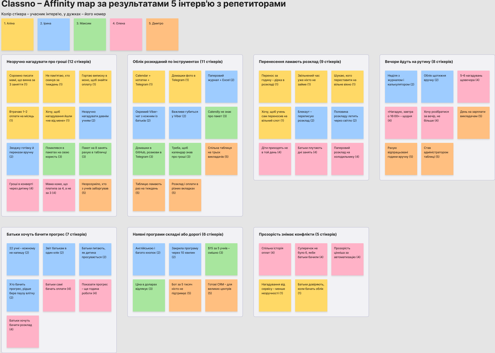{width=16.5cm}

Рисунок 1 – Affinity map за результатами інтерв'ю (FigJam)

Таблиця 13 – Кластери affinity map

| Кластер | Стікерів | Учасники |
| --- | --- | --- |
| Незручно нагадувати про гроші | 12 | 1, 2, 3, 4, 5 |
| Облік розкиданий по інструментах | 11 | 1, 2, 3, 5 |
| Перенесення ламають розклад | 9 | 1, 2, 4 |
| Вечори йдуть на рутину | 8 | 2, 4, 5 |
| Батьки хочуть бачити прогрес | 7 | 2, 4 |
| Наявні програми складні або дорогі | 6 | 2, 3, 5 |
| Прозорість знімає конфлікти | 5 | 1, 4 |

## 3.4. Топ-5 інсайтів

1. Більшість учасників втрачають гроші не через несумлінних учнів, а тому що соромляться нагадувати про оплату і не мають актуального обліку боргів.
2. Більшість учасників ведуть облік одночасно в 3–4 інструментах (календар, таблиця, нотатки, месенджер), і жоден із них не пов'язує заняття з оплатою.
3. Більшість учасників витрачають на адміністрування від 2 до 5 годин на тиждень, переважно вечорами і у вихідні.
4. Більшість учасників, що пробували спеціалізовані програми, відмовились від них через англомовний або перевантажений інтерфейс і ціну в доларах.
5. Більшість учасників, що працюють з дітьми, хочуть, щоб батьки самі бачили розклад, оплати і прогрес, – це зменшує конфлікти й відтік учнів.

# 4. Результати кількісного опитування

## 4.1. Опитувальник

Опитування створено в Google Forms: 19 запитань у 5 блоках (скринінг, демографія, поточна поведінка, оцінка проблеми, готовність платити). Відповідь «Ні» на перше запитання завершує анкету. Форма доступна за посиланням: https://docs.google.com/forms/d/e/1FAIpQLSeBYT82CbmNGsGTGj1-1N4Ilj4i8byev7FOqHBcct7bKEQ3kw/viewform, відповіді зібрано в Google Sheets. Посилання поширювалось у Telegram-спільнотах репетиторів НМТ, Facebook-групах викладачів англійської та музики, а також серед учасників інтерв'ю, які передали його колегам.

Таблиця 14 – Структура опитувальника

| Блок | Запитання | Тип |
| --- | --- | --- |
| Скринінг | Q1. Чи проводите ви приватні заняття зараз або протягом останніх 6 місяців? Q2. Чи стикаєтесь ви з труднощами в організації занять: розклад, оплати, облік учнів? | Так / Ні, Так / Іноді / Ні |
| Демографія | Q3. Вік. Q4. Що ви викладаєте? Q5. Скільки у вас активних учнів? Q6. Формат занять | Одиночний і множинний вибір |
| Поточна поведінка | Q7. Як часто ви стикаєтесь з організаційними проблемами? Q8. Яким чином ви ведете облік занять і оплат? Q9. Скільки часу на тиждень іде на адміністрування? Q10. Як учні вам платять? Q11. Як часто трапляються забуті оплати? Q12. Задоволеність поточним способом (1–5) | Одиночний і множинний вибір, шкала |
| Оцінка проблеми | Q13. Наскільки важливо вирішити проблему? Q14. «Мені важко відстежувати, хто скільки заплатив». Q15. «Перенесення і скасування забирають багато часу». Q16. «Хотів(ла) б надсилати звіти про прогрес, але не маю часу» | Шкала Лайкерта 1–5 |
| Готовність платити | Q17. Скільки ви готові платити щомісяця? Q18. Яка функція найважливіша? Q19. Що вас найбільше дратує в поточних способах? | Одиночний вибір, відкрите |

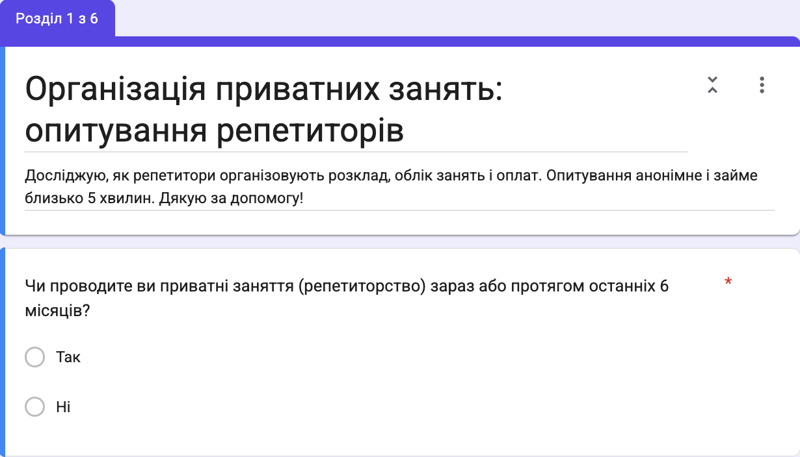{width=14cm}

Рисунок 2 – Початок форми опитування в Google Forms

## 4.2. Результати

Зібрано 32 відповіді, з них 28 від чинних репетиторів. Серед цільових респондентів 36% віком 18–24 роки, 68% викладають шкільні предмети або готують до НМТ, 46% працюють лише онлайн.

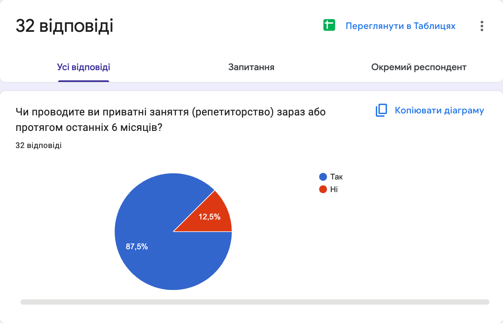{width=14cm}

Рисунок 3 – Скринінг респондентів (Google Forms)

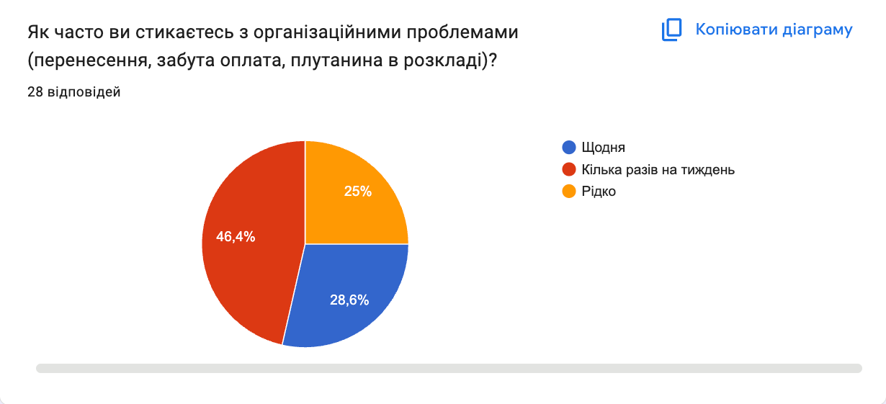{width=14cm}

Рисунок 4 – Частота організаційних проблем (Google Forms)

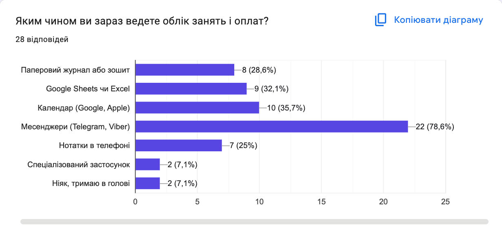{width=14cm}

Рисунок 5 – Поточні способи ведення обліку (Google Forms)

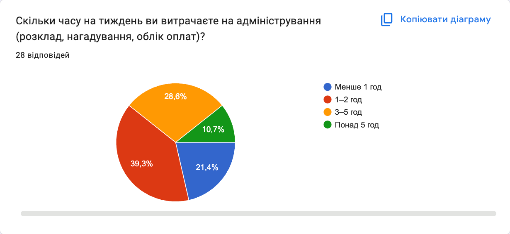{width=14cm}

Рисунок 6 – Час на адміністрування на тиждень (Google Forms)

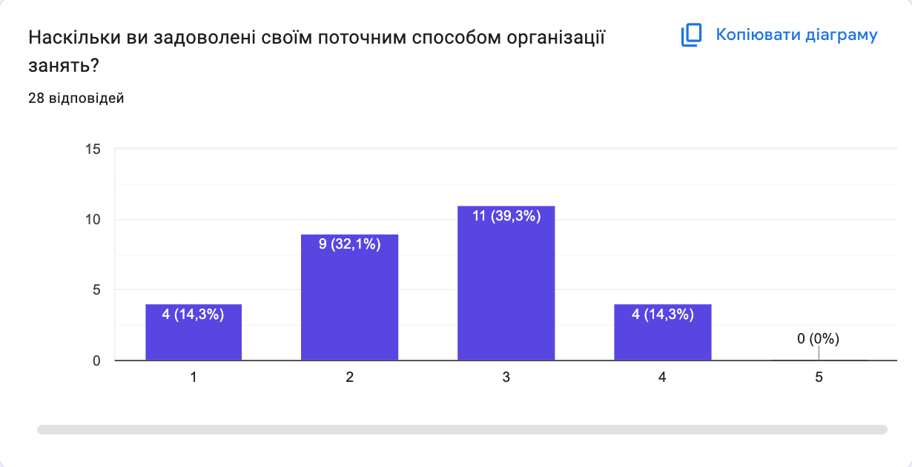{width=14cm}

Рисунок 7 – Задоволеність поточним способом організації занять (Google Forms)

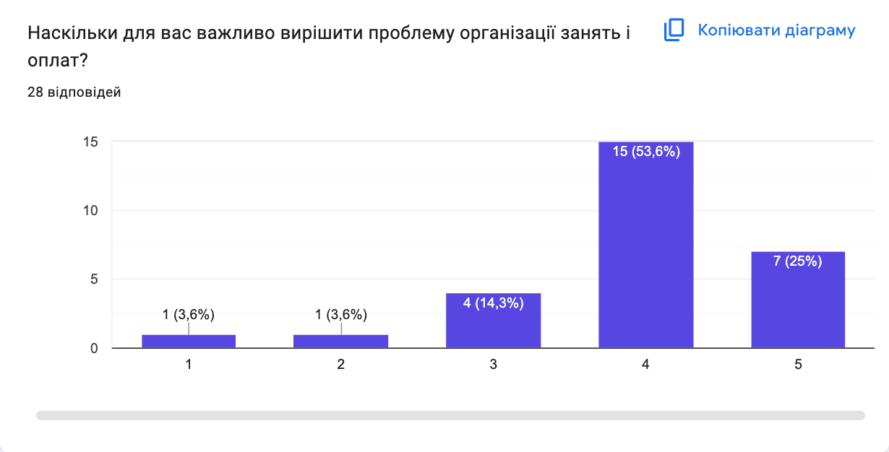{width=14cm}

Рисунок 8 – Важливість вирішення проблеми (Google Forms)

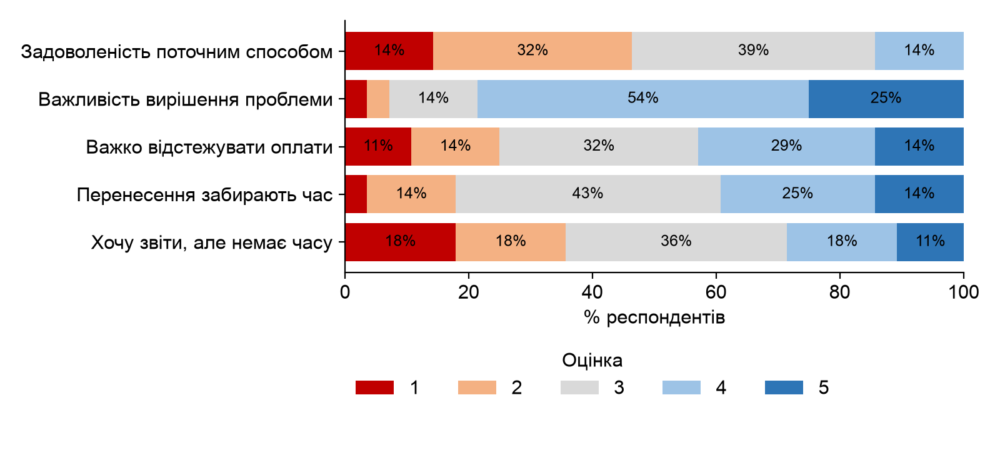{width=16cm}

Рисунок 9 – Зведений розподіл оцінок за шкалою Лайкерта (Q12–Q16)

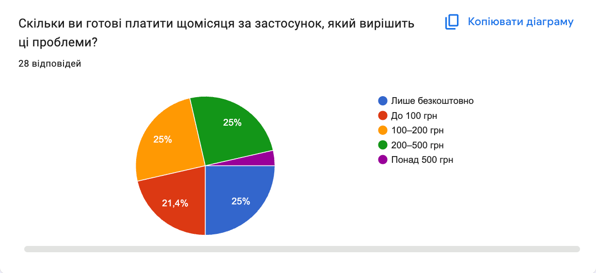{width=14cm}

Рисунок 10 – Готовність платити щомісяця (Google Forms)

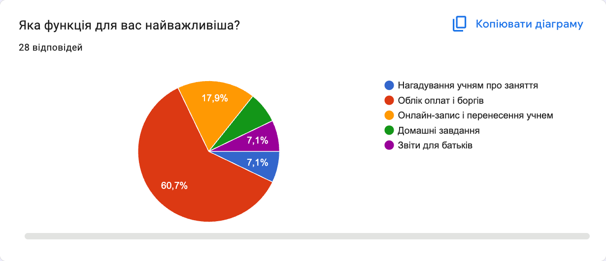{width=14cm}

Рисунок 11 – Найважливіша функція (Google Forms)

Відкриті відповіді на Q19 (22 з 28) закодовано вручну за темами, як у міні affinity mapping: оплати та борги – 6, перенесення та скасування – 5, хаос в інструментах – 4, рутина забирає час – 3, звіти для батьків – 2, незручні застосунки – 2.

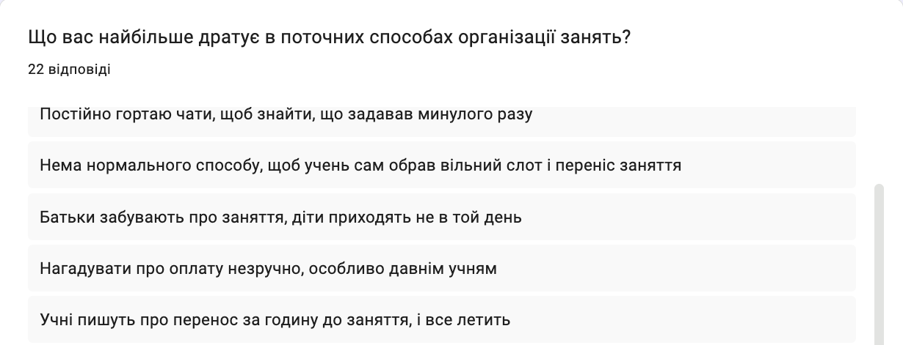{width=14cm}

Рисунок 12 – Фрагмент відкритих відповідей на Q19 (Google Forms)

Таблиця 15 – Зведені результати опитування

| Показник | Дані |
| --- | --- |
| Кількість відповідей | 32 |
| % цільової аудиторії (пройшли скринінг) | 88% (28 з 32) |
| % стикаються з проблемою щодня / часто | 29% щодня, 75% щодня або кілька разів на тиждень |
| Топ-3 поточних рішення | Месенджери – 79%, календар – 36%, Google Sheets чи Excel – 32% |
| Середня оцінка задоволеності поточними рішеннями (1–5) | 2.54 (медіана 3) |
| Середня оцінка важливості вирішення проблеми (1–5) | 3.93 (медіана 4) |
| Розподіл WTP | Лише безкоштовно – 25%, до 100 грн – 21%, 100–200 грн – 25%, 200–500 грн – 25%, понад 500 грн – 4% |
| Топ-3 болі за відкритими відповідями | Нагадування про оплату і борги, перенесення в останній момент, облік розкиданий по кількох інструментах |
| Головний висновок для продукту | Ключова цінність – облік оплат і боргів, пов'язаний з розкладом (61% назвали цю функцію найважливішою). Половина ЦА готова платити 100–500 грн/міс, тож ціна Pro 149 грн/міс вписується в очікування, а безкоштовний тариф потрібен для чверті, яка не платитиме |

## 4.3. Висновки з опитування

1. Проблема масова, але не гостра для всіх: 75% стикаються з нею щонайменше раз на тиждень, водночас задоволеність поточними рішеннями низька – 2.54 з 5. Люди терплять незручність, бо не бачать альтернативи.
2. Головний конкурент – не інший застосунок, а месенджер: 79% ведуть облік у Telegram чи Viber, і лише 7% користуються спеціалізованим застосунком. Продукт має інтегруватися з месенджерами, а не змушувати від них відмовитися.
3. Біль зростає з кількістю учнів: серед репетиторів з 11+ учнями адміністрування частіше займає 3–5 годин на тиждень. Це платоспроможний сегмент для тарифу Pro.
4. Функція «звіти для батьків» важлива для вузького сегмента викладачів, що працюють з дітьми (середня оцінка Q16 – 2.86), тож її варто робити другою хвилею, а не в MVP.

# 5. User Personas

Персони побудовано на основі двох найбільших сегментів опитування: студенти-репетитори віком 18–24 роки (36% респондентів) і репетитори з великим навантаженням на 11+ учнів (46%), серед яких переважають шкільні вчителі з приватною практикою. Прототипами стали учасниці інтерв'ю 1 і 2, цитати в персонах дослівні. Персони відрізняються не віком, а контекстом: для Аліни репетиторство – основний дохід із невеликою кількістю учнів онлайн, для Ірини – друга робота з великим навантаженням, батьками і готівкою.

Таблиця 16 – Persona 1: Аліна

| Поле | Опис |
| --- | --- |
| Ім'я, вік, фото (опис) | Аліна, 20 років. Невисока, з темним волоссям, зібраним у хвіст. Одягається просто й зручно: худі, джинси, кеди. На заняттях завжди в навушниках, говорить швидко й жваво |
| Місто / регіон | Київ |
| Посада та компанія | Студентка 3 курсу КПІ, приватна репетиторка з математики і підготовки до НМТ |
| Освіта та стаж | Неповна вища (прикладна математика), репетиторство – 2 роки |
| Рівень доходу | Близько 12 тис. грн/міс, 8 учнів по 350 грн за заняття |
| Цілі в контексті продукту | 1. Не втрачати гроші через забуті оплати. 2. Витрачати на організацію не більше 1 години на тиждень. 3. Зберегти повний розклад, коли учні переносять заняття. 4. Виглядати професійно в очах батьків |
| Болі та фрустрації | 1. «Я реально не пам'ятаю, хто скинув за минулий тиждень, доводиться гортати виписку в моно». 2. «Писати мамі учня, що вона винна за три заняття, – це для мене найгірше». 3. «Перенос за годину до заняття – і в мене дірка в розкладі, яку вже ніхто не займе». 4. «Розклад у календарі, оплати в нотатках, домашки в телеграмі – все в різних місцях» |
| Мотиватори при виборі рішення | Ціна (безкоштовно або до 100 грн), швидкість налаштування, мобільний застосунок, українська мова, рекомендація знайомих-репетиторів |
| Технопрофіль | Пристрої: iPhone, ноутбук. ОС: iOS. Застосунки: Telegram, Google Calendar, Zoom, Monobank, нотатки. Tech-рівень: просунутий |
| A Day in the Life | Зранку пари в університеті, між ними Аліна перевіряє домашні завдання, які учні надсилають фото в Telegram. З 16:00 до 21:00 – три-чотири онлайн-заняття поспіль у Zoom. О 15:00 учень пише, що не встигає, і вона шукає, кого переставити на звільнений час. Увечері згадує, що хтось мав оплатити пакет, і гортає виписку в Monobank |
| Канали інформації | ЗМІ: Telegram-канали про НМТ. Соцмережі: Instagram, TikTok. Спільноти: Telegram-чат репетиторів НМТ. Подкасти: не слухає |
| Ключова цитата | «Мені не складно вчити, мені складно бути собі бухгалтером і секретарем одночасно» |

Таблиця 17 – Persona 2: Ірина

| Поле | Опис |
| --- | --- |
| Ім'я, вік, фото (опис) | Ірина, 43 роки. Світле волосся до плечей, окуляри в тонкій оправі. Тримається спокійно й доброзичливо, говорить розмірено, як людина, що звикла пояснювати |
| Місто / регіон | Житомир |
| Посада та компанія | Вчителька англійської мови в ліцеї, приватна практика вдома й онлайн |
| Освіта та стаж | Вища педагогічна, стаж 19 років, приватна практика 12 років |
| Рівень доходу | Зарплата в ліцеї і близько 25 тис. грн/міс з приватних занять, 22 учні по 300–400 грн |
| Цілі в контексті продукту | 1. Звільнити неділю від обліку. 2. Звести готівку й перекази в одному місці без помилок. 3. Раз на місяць показувати батькам прогрес дитини без години роботи. 4. Швидко перебудовувати розклад під відключення світла |
| Болі та фрустрації | 1. «У неділю ввечері я сиджу з журналом і калькулятором, зводжу, хто що заплатив готівкою, а хто на картку». 2. «Батьки хочуть знати, як дитина просувається, а в мене двадцять два учні – кожному писати я фізично не можу». 3. «Коли вимикають світло, половина розкладу летить, і я все переписую заново». 4. «Я пробувала якусь програму для репетиторів, але там усе англійською і стільки кнопок, що я закрила її через десять хвилин». 5. «У вайбері сотні повідомлень від батьків, важливе губиться» |
| Мотиватори при виборі рішення | Простота і українська мова, можливість спробувати безкоштовно, налаштування без складних кроків. Ціна другорядна, якщо до 300 грн/міс |
| Технопрофіль | Пристрої: смартфон, ноутбук. ОС: Android, Windows. Застосунки: Viber, Zoom, Excel. Tech-рівень: середній |
| A Day in the Life | До 14:00 Ірина веде уроки в ліцеї. Після обіду – два офлайн-заняття вдома і три онлайн увечері. Між ними відповідає батькам у Viber, домовляється про перенесення через графік відключень. Готівку, яку приносять учні, записує в журнал, а в неділю переносить усе в Excel і рахує, хто скільки винен |
| Канали інформації | ЗМІ: «Нова українська школа». Соцмережі: Facebook. Спільноти: Facebook-групи вчителів англійської, вебінари British Council. Подкасти: не слухає |
| Ключова цитата | «Я хочу вчити дітей, а не вести бухгалтерію до ночі» |

# 6. Customer Journey Map

## 6.1. Сценарій

Таблиця 18 – Сценарій CJM

| Питання | Відповідь |
| --- | --- |
| Яку Persona обрано для CJM? | Аліна – найбільший сегмент ЦА (студенти-репетитори), для якої критичні ціна і швидкість старту |
| Який конкретний сценарій відображає CJM? | Аліна шукає спосіб вести облік оплат, знаходить Classno, налаштовує застосунок і починає ним користуватися щодня |
| З якого моменту починається Journey? | Наприкінці місяця Аліна виявляє, що один учень не заплатив за три заняття, а вона не помітила цього вчасно |
| Яким є успішний кінець Journey? | Усі учні й оплати ведуться в Classno, нагадування про заняття й оплату надходять автоматично, Аліна переходить на тариф Pro, коли набирає шостого учня |

## 6.2. Карта шляху клієнта

Таблиця 19 – Customer Journey Map для персони Аліна

| Аспект | Awareness | Consideration | Decision | Onboarding | Retention |
| ---------- | ------------- | ------------- | ------------- | ------------- | ------------- |
| Дії користувача | Помічає борг за 3 заняття, питає в чаті репетиторів, як вони ведуть облік | Гуглить «застосунок для репетитора», пробує TutorBird і ЯРепетитор, читає відгуки | Бачить допис у Telegram-каналі про Classno, завантажує застосунок, реєструється через Google | Додає 8 учнів і розклад, налаштовує вартість занять, вмикає нагадування в Telegram | Щодня відмічає заняття, бачить борги на головному екрані, ділиться з учнями посиланням для перенесення |
| Думки | «Так більше не можна, я вже втрачаю гроші» | «Все англійською, \$17 на місяць – це два моїх заняття» | «Безкоштовно до 5 учнів і українською – спробую» | «Вносити всіх вручну довго, чи варто воно того?» | «Мені навіть не треба нагадувати про гроші самій» |
| Емоції (1–5) | 2 | 3 | 4 | 3 | 5 |
| Touchpoints | Telegram-чат репетиторів, Monobank | Google, App Store, Capterra, Reddit | Telegram-канал, App Store, лендинг | Застосунок, онбординг, Telegram-бот | Push-сповіщення, Telegram-бот, email з підсумком місяця |
| Болі / проблеми | Немає обліку, соромно нагадувати про борг | Рішення дорогі, англомовні, перевантажені | Страх знову витратити час на непотрібний застосунок | Ручне введення учнів, незрозуміло, як налаштувати пакети | Ліміт 5 учнів безкоштовного тарифу, учні ігнорують бота |
| Можливості для покращення | Контент про облік для репетиторів у Telegram і TikTok | Порівняльна сторінка «Classno vs TutorBird», ціна в гривнях | Реєстрація в один клік, відгуки реальних репетиторів | Імпорт учнів із Google Calendar і контактів, шаблон пакета занять | Місячний звіт «скільки ви заробили», м'який перехід на Pro, реферальна програма |

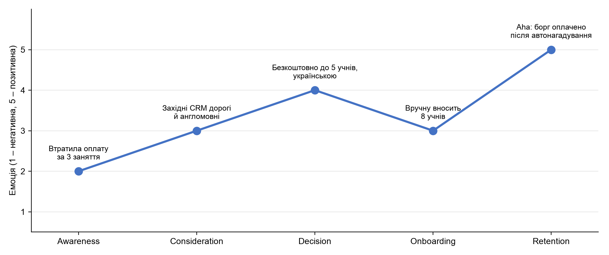{width=16.5cm}

Рисунок 13 – Емоційна крива Customer Journey Map

## 6.3. Ключові інсайти CJM

1. Найбільша фрустрація – на етапі Awareness (2 з 5): Аліна вже втратила гроші і відчуває сором через необхідність нагадувати про борг. Усередині продукту найбільший спад – на Onboarding (з 4 до 3): ручне введення учнів забирає енергію ще до того, як користувач побачив цінність.
2. Момент АГА! настає на переході від Onboarding до Retention, коли учень оплачує борг після автоматичного нагадування, а Аліні не довелося писати самій. Для цього потрібно, щоб до кінця першого тижня були внесені учні, їхні ціни і ввімкнено нагадування в Telegram.
3. Найважливіші для конверсії touchpoints – Telegram-спільноти репетиторів (основне джерело довіри і рекомендацій), сторінка в App Store з українськими відгуками і Telegram-бот нагадувань, через який продукт бачать учні і батьки.
4. Три зміни, що найбільше покращать Journey: імпорт учнів із Google Calendar і контактів за хвилину, нагадування про оплату від імені сервісу одразу в першому сеансі, прозорий перехід на Pro з пробним місяцем, коли користувач додає шостого учня.

# Висновки

У роботі проведено ринковий аналіз і дослідження користувачів для Classno – застосунку для обліку занять і оплат приватних репетиторів.

1. Ринок ПЗ для управління репетиторством становить \$2.8 млрд і зростає на 11.7% на рік. Обслуговуваний ринок в Україні оцінено обома методами в \$5.1–6.2 млн на рік, реалістичний SOM на третій рік – близько 3.8 млн грн, або 1.8% SAM. Український ринок невеликий, тому діаспора і Східна Європа – обов'язковий наступний крок.
2. Прямі конкуренти – західні CRM за \$16–48 на місяць, англомовні й орієнтовані на центри. Локальні застосунки мають низькі рейтинги. Україномовного рішення для індивідуального репетитора з доступною ціною немає.
3. Головний конкурент продукту – месенджери: у них веде облік 79% репетиторів, спеціалізованим застосунком користуються лише 7%. Тому MVP має працювати разом із Telegram і Viber, а не замінювати їх.
4. Ключовий біль – не нестача інструментів, а емоційна незручність нагадувати про гроші. 61% респондентів назвали облік оплат і боргів найважливішою функцією, отже, ядро MVP – облік боргів, пов'язаний з розкладом, і автоматичні нагадування від імені сервісу.
5. Ціноутворення підтверджено: половина ЦА готова платити 100–500 грн на місяць, чверть – лише безкоштовно. Модель freemium з тарифом Pro за 149 грн і безкоштовним лімітом у 5 учнів відповідає цьому розподілу. Міні-школи – окремий сегмент з удесятеро вищою WTP для тарифу Studio в наступних версіях.

# Список джерел

1. Private Tutoring Market Size, Share & Industry Growth, 2034. Fortune Business Insights. URL: https://www.fortunebusinessinsights.com/private-tutoring-market-104753 (дата звернення: 28.09.2026).
2. Online Tutoring Services Market Size. Industry Report, 2030. Grand View Research. URL: https://www.grandviewresearch.com/industry-analysis/online-tutoring-services-market (дата звернення: 28.09.2026); дзеркало звіту: GII Research. URL: https://www.giiresearch.com/report/grvi1611729-online-tutoring-services-market-size-share-trends.html (дата звернення: 28.09.2026).
3. Tutoring Management Software Market. Dataintelo. URL: https://dataintelo.com/report/tutoring-management-software-market (дата звернення: 28.09.2026).
4. Реєстрація на НМТ 2026 завершилася: буде понад 373 тисячі учасників – більше, ніж торік. Освіторія. URL: https://osvitoria.media/news/reyestratsiya-na-nmt-2026-zavershylasya-bude-ponad-373-tysyachi-uchasnykiv-bilshe-nizh-torik/ (дата звернення: 28.09.2026).
5. НМТ отримав кредит довіри суспільства, школа програє репетиторам у підготовці: результати дослідження. Освіторія, 05.06.2026. URL: https://osvitoria.media/news/nmt-otrymav-kredyt-doviry-suspilstva-shkola-prograye-repetytoram-u-pidgotovtsi-rezultaty-doslidzhennya/ (дата звернення: 28.09.2026).
6. Скільки старшокласників ходять до репетиторів: дані опитування. Главком, 23.09.2024. URL: https://glavcom.ua/country/science/polovina-starshoklasnikiv-khodjat-do-repetitoriv-bo-vvazhajut-znannja-otrimani-u-shkoli-nedostatnimi-kmis-1022045.html (дата звернення: 28.09.2026).
7. Репетитори в Україні; Репетитор з математики; Репетитор англійської мови; Репетитор з математики НМТ. BUKI. URL: https://buki.com.ua/tutors/ ; https://buki.com.ua/tutors/matematyka/ ; https://buki.com.ua/tutors/anhliiska-mova/ ; https://buki.com.ua/tutors/matematyka/zno-1/ (дата звернення: 28.09.2026).
8. Скільки українських школярів перебувають за кордоном: міністр назвав кількість. Главком, 26.08.2026. URL: https://glavcom.ua/country/science/skilki-ukrajinskikh-shkoljariv-perebuvajut-za-kordonom-ministr-nazvav-pribliznu-kilkist-1138906.html (дата звернення: 28.09.2026).
9. Відгуки про TutorBird, Teachworks, TutorCruncher, My Music Staff. Capterra. URL: https://www.capterra.com/p/181623/TutorBird/reviews/ ; https://www.capterra.com/p/233485/Teachworks/reviews/ ; https://www.capterra.com/p/145838/TutorCruncher/reviews/ ; https://www.capterra.com/p/148451/My-Music-Staff/reviews/ (дата звернення: 28.09.2026).
10. Pricing. TutorBird. URL: https://www.tutorbird.com/pricing/ (дата звернення: 28.09.2026).
11. Pricing. Teachworks. URL: https://teachworks.com/pricing (дата звернення: 28.09.2026).
12. Pricing. My Music Staff. URL: https://www.mymusicstaff.com/pricing/ (дата звернення: 28.09.2026).
13. Plans & Pricing. TutorCruncher. URL: https://tutorcruncher.com/pricing/ (дата звернення: 28.09.2026).
14. Pricing. Wise; Wise: Tutor Management Software. Capterra. URL: https://www.wise.live/pricing ; https://www.capterra.com/p/264506/Wise/ (дата звернення: 28.09.2026).
15. Preply commission model. Preply Help Center. URL: https://help.preply.com/en/articles/4171383-preply-commission-model (дата звернення: 28.09.2026).
16. Pricing. Calendly. URL: https://calendly.com/pricing (дата звернення: 28.09.2026).
17. New Research: Majority of High School Students Use Generative AI for Schoolwork. College Board Newsroom, 06.10.2025. URL: https://newsroom.collegeboard.org/new-research-majority-high-school-students-use-generative-ai-schoolwork (дата звернення: 28.09.2026).
18. Khan Academy Annual Report: SY24-25. Khan Academy. URL: https://annualreport.khanacademy.org/ (дата звернення: 28.09.2026).
19. ФОП для репетитора 2025: інструкція з відкриття. Factor Academy. URL: https://factor.academy/blog/fop-dlya-repetitora-2025-instrukciya-z-vidkrittya/ (дата звернення: 28.09.2026).
20. FigJam: online whiteboard for teams. Figma. URL: https://www.figma.com/figjam/ (дата звернення: 28.09.2026).
21. ЯРепетитор. Google Play. URL: https://play.google.com/store/apps/details?id=studio.clapp.yarepetitor&hl=uk (дата звернення: 28.09.2026).
22. Мой Класс. Google Play. URL: https://play.google.com/store/apps/details?id=com.app.moyclass&hl=uk (дата звернення: 28.09.2026).
23. Wise – Online Teaching app. Google Play; Wise – Teach Online. App Store. URL: https://play.google.com/store/apps/details?id=com.wise.app&hl=uk ; https://apps.apple.com/us/app/wise-teach-online/id1525875644 (дата звернення: 28.09.2026).
24. GDP per capita, PPP (current international \$) – Ukraine, European Union. World Bank Open Data. URL: https://data.worldbank.org/indicator/NY.GDP.PCAP.PP.CD?locations=UA-EU (дата звернення: 28.09.2026).
25. Population, total – Ukraine, European Union. World Bank Open Data. URL: https://data.worldbank.org/indicator/SP.POP.TOTL?locations=UA-EU (дата звернення: 28.09.2026).
26. World Population Prospects 2024. United Nations, Population Division. URL: https://population.un.org/wpp/ (дата звернення: 28.09.2026).
