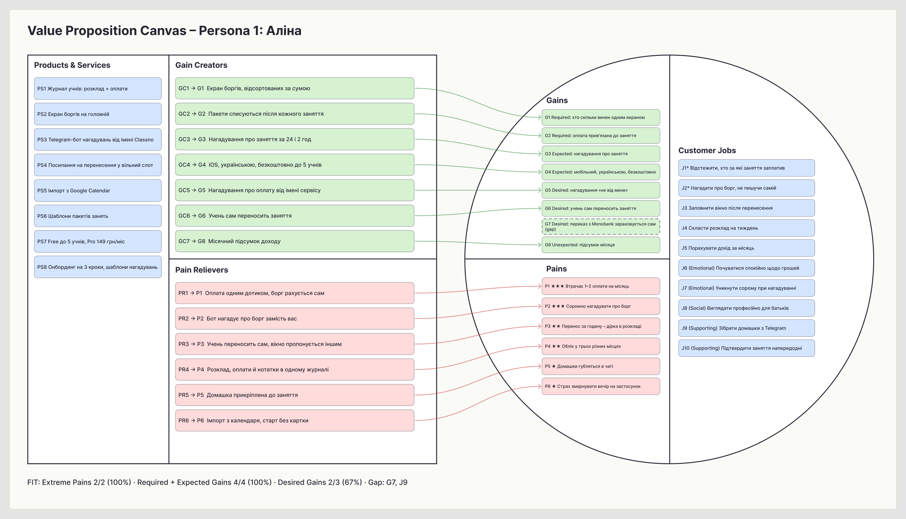
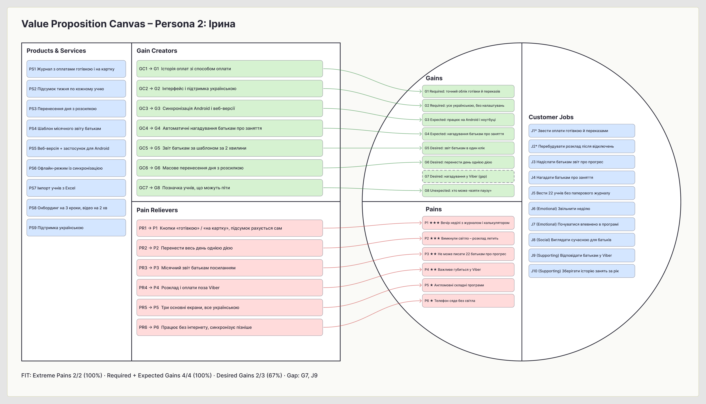

# Мета роботи

Навчитись формулювати Jobs-to-be-Done на трьох рівнях, будувати Value Proposition Canvas та перевіряти відповідність між проблемами користувачів та рішенням продукту.

Робота продовжує практичну роботу № 1 і спирається на її дані: продукт Classno – застосунок для обліку занять, оплат і нагадувань для приватних репетиторів; персони Аліна (студентка-репетиторка, 8 учнів онлайн) та Ірина (вчителька англійської з приватною практикою, 22 учні); п'ять глибинних інтерв'ю, опитування 28 репетиторів і конкурентний аналіз.

# 1. Job Statements

### Додаткові JTBD-інтерв'ю

Інтерв'ю практичної роботи № 1 були зосереджені на поточній поведінці й болях, а не на моменті перемикання між рішеннями. Тому з прототипами обох персон проведено короткі повторні розмови за методом Switch Interview [3]: 01.10.2026 з Аліною (15 хв) і 02.10.2026 з Іриною (17 хв), обидві онлайн у Google Meet. Розмова будувалась навколо конкретного дня, коли учасниця почала шукати інший спосіб вести облік, і чотирьох сил, що штовхали до зміни або стримували її.

Таблиця 1 – Ключові відповіді switch-інтерв'ю

| Сила | Аліна | Ірина |
| ------------ | -------------------------------------------- | -------------------------------------------- |
| Push | «У березні я помітила, що Даня не платив три тижні, тільки коли рахувала дохід за місяць. Тоді й зрозуміла, що нотатки не працюють» | «Минулої зими світло вимикали за графіком, я переписувала розклад тричі на тиждень, а в неділю ще й зводила оплати. Я просто сіла й заплакала над журналом» |
| Pull | «Хочу відкрити телефон і за секунду побачити: оцей винен за два заняття, оця за одне» | «Щоб воно саме рахувало, а я тільки ставила галочку, що заплатили» |
| Anxiety | «Боюсь, що вб'ю вечір на те, щоб усіх занести, а потім закину, як ЯРепетитор». «Якщо бот напише мамі якось не так, вийде ще гірше, ніж коли пишу я» | «Що як телефон сяде, коли нема світла, і я не побачу, хто коли приходить». «Що я не розберусь і доведеться просити сина» |
| Habit | «Нотатки завжди під рукою, це дві секунди». «У моно і так видно перекази, просто треба погортати» | «Паперовий журнал я веду двадцять років, він ніколи не зависає». «Батьки звикли писати мені у вайбер» |

### Формулювання Job Statements

На основі інтерв'ю обох практичних робіт і відкритих відповідей опитування сформульовано 10 Job Statements за форматом «Коли…, я хочу…, щоб…» [1], [2]. Пріоритет визначено за частотою теми в affinity map і опитуванні та за тим, наскільки погано її закривають поточні рішення.

Таблиця 2 – Job Statements

| № | Persona | Тип Job | Job Statement | Пріоритет |
| ----- | ------------ | -------------- | -------------------------------------------------------- | ------------- |
| 1 | Аліна | Functional | Коли учень скидає оплату на картку, я хочу одразу позначити, за які заняття він заплатив, щоб наприкінці тижня не гортати виписку і точно знати, хто мені винен | High |
| 2 | Аліна | Functional | Коли в учня назбирався борг, я хочу, щоб йому прийшло нагадування про оплату без мого особистого повідомлення, щоб отримати гроші і не псувати стосунки з батьками | High |
| 3 | Аліна | Functional | Коли учень переносить заняття в останній момент, я хочу швидко знайти, кого поставити на звільнений час, щоб не втратити дохід за цю годину | Med |
| 4 | Аліна | Emotional | Коли я думаю про гроші за заняття, я хочу почуватися спокійно й упевнено, щоб не відчувати сорому, ніби випрошую свої ж гроші | High |
| 5 | Аліна | Social | Коли я спілкуюся з батьками учнів, я хочу виглядати організованою і професійною, щоб мене сприймали як серйозного викладача, а не студентку на підробітку | Med |
| 6 | Ірина | Functional | Коли наприкінці тижня я зводжу оплати готівкою і на картку, я хочу бачити вже готовий підсумок по кожному учню, щоб не витрачати на це вечір неділі | High |
| 7 | Ірина | Functional | Коли батьки питають, як просувається дитина, я хочу за кілька хвилин надіслати їм зрозумілий звіт, щоб не писати двадцять два окремі повідомлення | Med |
| 8 | Ірина | Functional | Коли через відключення світла заняття зсуваються, я хочу швидко перебудувати розклад і попередити всіх учнів, щоб ніхто не прийшов не в той час | High |
| 9 | Ірина | Emotional | Коли я пробую нову програму, я хочу з першого разу розуміти, що робити, щоб не почуватися відсталою і не просити допомоги в сина | Med |
| 10 | Ірина | Social | Коли батьки обирають репетитора для дитини, я хочу виглядати сучасною і надійною викладачкою, щоб вони залишались зі мною і рекомендували мене знайомим | Low |

Функціональних jobs шість, емоційних і соціальних – по два. Найвищий пріоритет мають jobs, пов'язані з грошима: облік оплат (1, 6) і нагадування про борг (2), а також емоційна робота 4. Вона пояснює, чому облік боргів болить сильніше, ніж має боліти суто технічна задача: проблема не в підрахунку, а в незручності нагадувати.

# 2. Four Forces Analysis

Для аналізу чотирьох сил [3], [4] обрано три функціональні jobs, що покривають три найбільші кластери affinity map практичної роботи № 1: «Незручно нагадувати про гроші» (12 стікерів), «Облік розкиданий по інструментах» (11) і «Перенесення ламають розклад» (9).

Таблиця 3 – Four Forces для Job № 2: «Отримати борг без особистого нагадування»

| Поле | Зміст |
| ---------------------- | ------------------------------------------------------------------------------ |
| Push | 1. «Писати мамі учня, що вона винна за три заняття, – це для мене найгірше» (Аліна). 2. «У березні я помітила, що Даня не платив три тижні, тільки коли рахувала дохід за місяць» (Аліна). 3. «Незручно нагадувати давнім учням, вони ж уже як свої» (Ірина). 4. Аліна втрачає до 1–2 оплат на місяць, бо відкладає нагадування |
| Pull | Нагадування, що приходять «не від мене»: репетитор лише бачить, що борг погашено. Уявне краще майбутнє – «мені навіть не треба нагадувати про гроші самій» |
| Anxiety | 1. «Якщо бот напише мамі якось не так, вийде ще гірше, ніж коли пишу я» (Аліна). 2. Страх, що автоматичне нагадування виглядатиме як недовіра до давніх учнів. 3. Учні можуть ігнорувати повідомлення бота |
| Habit | Повідомлення в Telegram пишеться за хвилину і «так роблять усі». Частину боргів закривають самі учні, тому здається, що система й так працює |
| Продуктовий висновок | Push: показувати борг автоматично, щойно заняття відбулось, а не наприкінці місяця. Pull: нагадування надходить від імені Classno, репетитор його не пише. Anxiety: репетитор бачить і редагує текст нагадування перед першим надсиланням, тон за замовчуванням ввічливий і нейтральний. Habit: нагадування приходить у звичний учням Telegram, а не в новий застосунок |

Таблиця 4 – Four Forces для Job № 6: «Звести оплати за тиждень без ручного перерахунку»

| Поле | Зміст |
| ---------------------- | ------------------------------------------------------------------------------ |
| Push | 1. «У неділю ввечері я сиджу з журналом і калькулятором, зводжу, хто що заплатив готівкою, а хто на картку» (Ірина). 2. «Я реально не пам'ятаю, хто скинув за минулий тиждень, доводиться гортати виписку в моно» (Аліна). 3. «Пакет на вісім занять я рахую в табличці вручну, і вже двічі помилявся на свою користь» (Максим). 4. Облік одночасно ведеться в 3–4 інструментах, і жоден не пов'язує заняття з оплатою |
| Pull | «Щоб воно саме рахувало, а я тільки ставила галочку, що заплатили» (Ірина). Вечір неділі вільний, підсумок тижня готовий без калькулятора |
| Anxiety | 1. «Що як телефон сяде, коли нема світла, і я не побачу, хто коли приходить» (Ірина). 2. «Боюсь, що вб'ю вечір на те, щоб усіх занести, а потім закину» (Аліна). 3. Готівку, отриману від дитини, легко забути внести одразу |
| Habit | «Паперовий журнал я веду двадцять років, він ніколи не зависає» (Ірина). Excel і нотатки безкоштовні й знайомі, переходити ні на що не треба |
| Продуктовий висновок | Push: оплата відмічається одним дотиком біля заняття, борг рахується сам. Pull: щонеділі приходить готовий підсумок тижня по кожному учню. Anxiety: дані зберігаються локально й синхронізуються, щойно з'являється зв'язок; учнів можна імпортувати з календаря чи таблиці за кілька хвилин. Habit: екран обліку схожий на звичний журнал – рядок на учня, клітинка на заняття |

Таблиця 5 – Four Forces для Job № 3: «Не втратити дохід через перенесення»

| Поле | Зміст |
| ---------------------- | ------------------------------------------------------------------------------ |
| Push | 1. «Перенос за годину до заняття – і в мене дірка в розкладі, яку вже ніхто не займе» (Аліна). 2. «Коли вимикають світло, половина розкладу летить, і я все переписую заново» (Ірина). 3. «Діти приходять не в той день, бо батьки переплутали» (Олена) |
| Pull | Учень сам обирає новий час із вільних слотів, а репетитор лише бачить оновлений розклад. Звільнене вікно одразу пропонується іншим учням |
| Anxiety | 1. Учні почнуть переносити заняття частіше, якщо це стане надто легко. 2. «Не хочу, щоб хтось бачив весь мій розклад» (Аліна) |
| Habit | Домовитися в месенджері звично і «по-людськи». Розклад у голові й календарі здається достатнім, поки учнів мало |
| Продуктовий висновок | Push: перенесення в один крок з автоматичним оновленням розкладу. Pull: посилання на вибір вільного слоту для учня. Anxiety: репетитор задає, за скільки годин до заняття перенесення ще можливе, учень бачить лише вільні вікна, а не чужі заняття. Habit: запит на перенесення приходить у той самий Telegram-чат |

Чотири сили показують, що перехід на Classno гальмує не функціональна, а емоційна складова: страх зіпсувати стосунки з учнями й страх змарнувати вечір на налаштування. Тому продукт має знімати Anxiety так само цілеспрямовано, як закривати Push.

# 3. Value Proposition Canvas – Persona 1: Аліна

Канвас побудовано на дошці FigJam [16] за шаблоном Strategyzer [5], [6] у порядку, який задає методика: спершу Customer Profile (Jobs, потім Pains, потім Gains), потім Value Map. Кожен елемент має код: J – job, P – pain, G – gain, PS – продукт чи послуга, PR – pain reliever, GC – gain creator. Код у дужках після pain reliever чи gain creator показує, який pain або gain він закриває, і замінює стрілки на рисунку. Зірочкою позначено критичні jobs, де наявні рішення найслабші.

{width=16.5cm}

Рисунок 1 – Value Proposition Canvas для персони Аліна (FigJam)

## 3.1. Customer Profile

Таблиця 6 – Customer Jobs: Аліна

| Тип | Jobs |
| ------------------ | ---------------------------------------------------------------------------------- |
| Functional | J1\*. Відстежити, хто з учнів за які заняття заплатив. J2\*. Нагадати про борг, не пишучи самій. J3. Заповнити вікно після перенесення в останній момент. J4. Скласти розклад на тиждень між парами й заняттями. J5. Порахувати дохід за місяць |
| Emotional | J6. Почуватися спокійно щодо грошей. J7. Уникнути сорому, коли треба нагадати про оплату |
| Social | J8. Виглядати організованою і професійною в очах батьків |
| Supporting | J9. Зібрати домашні завдання, які учні надсилають фото в Telegram. J10. Підтвердити заняття напередодні |

Таблиця 7 – Pains: Аліна

| Рівень | Pains |
| ------------------ | ---------------------------------------------------------------------------------- |
| Extreme ★★★ | P1. Втрачає 1–2 оплати на місяць: «Я реально не пам'ятаю, хто скинув за минулий тиждень, доводиться гортати виписку в моно» (небажаний наслідок). P2. Соромно нагадувати про борг: «Писати мамі учня, що вона винна за три заняття, – це для мене найгірше» (фрустрація) |
| Moderate ★★ | P3. «Перенос за годину до заняття – і в мене дірка в розкладі, яку вже ніхто не займе» (небажаний наслідок). P4. «Розклад у календарі, оплати в нотатках, домашки в телеграмі – все в різних місцях» (перешкода) |
| Slight ★ | P5. Домашні завдання губляться в листуванні серед інших повідомлень (перешкода). P6. Страх знову змарнувати вечір на застосунок, який доведеться закинути (ризик) |

Таблиця 8 – Gains: Аліна

| Категорія | Gains |
| ------------------ | ---------------------------------------------------------------------------------- |
| Required | G1. Одним екраном бачити, хто скільки винен. G2. Кожна оплата прив'язана до конкретного заняття або пакета |
| Expected | G3. Нагадування учням про заняття. G4. Мобільний застосунок українською, безкоштовний для старту |
| Desired | G5. Нагадування про оплату надходять від імені сервісу, «не від мене». G6. Учень сам переносить заняття на вільний слот. G7. Переказ на Monobank сам позначається як оплата |
| Unexpected | G8. Підсумок місяця: скільки зароблено, скільки занять, хто з учнів платить із запізненням |

## 3.2. Value Map

Таблиця 9 – Products & Services: Аліна

| Тип | Products & Services |
| ------------------ | ---------------------------------------------------------------------------------- |
| Core | PS1. Журнал учнів, у якому розклад і оплати пов'язані. PS2. Екран боргів на головній. PS3. Telegram-бот нагадувань про заняття й оплату від імені Classno |
| Supporting | PS4. Посилання для учня на перенесення у вільний слот. PS5. Імпорт учнів і розкладу з Google Calendar. PS6. Шаблони пакетів занять |
| Service | PS7. Безкоштовний тариф до 5 учнів, Pro за 149 грн/міс. PS8. Онбординг на 3 кроки і шаблони ввічливих нагадувань |

Таблиця 10 – Pain Relievers і Gain Creators: Аліна

| Код | Pain Reliever | Закриває | Ранг |
| -------- | -------------------------------------------------------------- | ------------ | ------------------ |
| PR1 | Оплата відмічається одним дотиком біля заняття, борг рахується автоматично | P1 | Essential |
| PR2 | Нагадування про борг надсилає бот від імені Classno за налаштованим графіком | P2 | Essential |
| PR3 | Учень отримує посилання на вільні слоти й переносить заняття сам, звільнене вікно пропонується іншим | P3 | Essential |
| PR4 | Розклад, оплати й нотатки до занять в одному журналі | P4 | Essential |
| PR5 | Домашнє завдання прикріплюється до конкретного заняття | P5 | Nice-to-have |
| PR6 | Імпорт з Google Calendar і безкоштовний старт без картки | P6 | Nice-to-have |

| Код | Gain Creator | Створює | Ранг |
| -------- | -------------------------------------------------------------- | ------------ | ------------------ |
| GC1 | Головний екран зі списком боргів, відсортованим за сумою | G1 | Essential |
| GC2 | Пакети занять списуються автоматично після кожного заняття | G2 | Essential |
| GC3 | Нагадування про заняття за 24 і 2 години | G3 | Essential |
| GC4 | Застосунок для iOS українською, безкоштовно до 5 учнів | G4 | Essential |
| GC5 | Тексти нагадувань про оплату від імені сервісу з можливістю редагувати | G5 | Essential |
| GC6 | Самостійне перенесення учнем у межах правил репетитора | G6 | Nice-to-have |
| GC7 | Місячний підсумок доходу й учнів, що платять із запізненням | G8 | Nice-to-have |

## 3.3. Аналіз FIT

Таблиця 11 – Покриття Customer Profile: Аліна

| Група | Покрито | Покриття | Ціль |
| ---------------------------------- | -------------------------- | -------------------- | -------------------- |
| Extreme Pains | P1, P2 з 2 | 100% | 100% |
| Moderate Pains | P3, P4 з 2 | 100% | – |
| Required і Expected Gains | G1–G4 з 4 | 100% | 100% |
| Desired Gains | G5, G6 з 3 | 67% | ≥ 50% |
| Unexpected Gains | G8 з 1 | 100% | – |

Gap Analysis. Без продуктового рішення лишаються:

1. G7 – автоматичне зарахування переказів з Monobank. Банк надає персональний API, але інтеграція складніша за MVP і потребує довіри користувача до доступу до виписки (ризик, названий в інтерв'ю Аліни). Кандидат у backlog другої версії.
2. Supporting job J9 – перевірка домашніх завдань. PR5 лише прив'язує файл до заняття, але не замінює Telegram, у якому учні їх надсилають.
3. Supporting job J3 частково – пошук нового учня на звільнений слот поза поточними учнями. Classno пропонує вікно лише своїм учням.

Топ-3 для MVP: Pain Relievers PR1, PR2, PR4 і Gain Creators GC1, GC2, GC5. Разом вони закривають обидва Extreme Pains і головний Desired Gain «нагадування не від мене», який для Аліни важливіший за будь-яку нову функцію.

# 4. Value Proposition Canvas – Persona 2: Ірина

Канвас Ірини відрізняється від канвасу Аліни контекстом: велика кількість учнів, готівка, батьки, Viber, відключення світла і низька толерантність до складних інтерфейсів.

{width=16.5cm}

Рисунок 2 – Value Proposition Canvas для персони Ірина (FigJam)

## 4.1. Customer Profile

Таблиця 12 – Customer Jobs: Ірина

| Тип | Jobs |
| ------------------ | ---------------------------------------------------------------------------------- |
| Functional | J1\*. Звести оплати готівкою й переказами за тиждень. J2\*. Перебудувати розклад після зміни графіка відключень. J3. Надіслати батькам звіт про прогрес дитини. J4. Нагадати батькам про заняття. J5. Вести облік 22 учнів без паперового журналу |
| Emotional | J6. Звільнити неділю й не відчувати, що робота поглинає особисте життя. J7. Почуватися впевнено в новій програмі з першого разу |
| Social | J8. Виглядати сучасною і надійною викладачкою для батьків |
| Supporting | J9. Відповідати батькам у Viber, не гублячи важливе. J10. Зберігати історію занять кожного учня за навчальний рік |

Таблиця 13 – Pains: Ірина

| Рівень | Pains |
| ------------------ | ---------------------------------------------------------------------------------- |
| Extreme ★★★ | P1. «У неділю ввечері я сиджу з журналом і калькулятором, зводжу, хто що заплатив готівкою, а хто на картку» (перешкода). P2. «Коли вимикають світло, половина розкладу летить, і я все переписую заново» (небажаний наслідок) |
| Moderate ★★ | P3. «Батьки хочуть знати, як дитина просувається, а в мене двадцять два учні – кожному писати я фізично не можу» (перешкода). P4. «У вайбері сотні повідомлень від батьків, важливе губиться» (фрустрація) |
| Slight ★ | P5. «Я пробувала якусь програму для репетиторів, але там усе англійською і стільки кнопок, що я закрила її через десять хвилин» (фрустрація). P6. «Що як телефон сяде, коли нема світла, і я не побачу, хто коли приходить» (ризик) |

Таблиця 14 – Gains: Ірина

| Категорія | Gains |
| ------------------ | ---------------------------------------------------------------------------------- |
| Required | G1. Точний облік готівки й переказів по кожному учню. G2. Повністю український інтерфейс без складних налаштувань |
| Expected | G3. Працює і з Android-смартфона, і з ноутбука. G4. Нагадування батькам про заняття |
| Desired | G5. Звіт батькам «в один клік» раз на місяць. G6. Перенести цілий день занять однією дією з повідомленням усім. G7. Нагадування приходять батькам у Viber |
| Unexpected | G8. Підказка, які учні ризикують «взяти паузу», за пропусками й оплатами |

## 4.2. Value Map

Таблиця 15 – Products & Services: Ірина

| Тип | Products & Services |
| ------------------ | ---------------------------------------------------------------------------------- |
| Core | PS1. Журнал учнів з обліком оплат готівкою і переказом. PS2. Підсумок тижня по кожному учню. PS3. Перенесення дня занять з розсилкою |
| Supporting | PS4. Шаблон місячного звіту батькам. PS5. Веб-версія для ноутбука і застосунок для Android. PS6. Офлайн-режим із синхронізацією. PS7. Імпорт учнів з Excel |
| Service | PS8. Онбординг українською на 3 кроки і відеоінструкція на 2 хв. PS9. Чат підтримки українською |

Таблиця 16 – Pain Relievers і Gain Creators: Ірина

| Код | Pain Reliever | Закриває | Ранг |
| -------- | -------------------------------------------------------------- | ------------ | ------------------ |
| PR1 | Кнопки «готівкою» і «на картку» біля кожного заняття, борг і підсумок тижня рахуються самі | P1 | Essential |
| PR2 | Перенесення всіх занять дня однією дією з автоматичним повідомленням учням | P2 | Essential |
| PR3 | Місячний звіт батькам із відвідуваності й нотаток до занять, надсилається посиланням | P3 | Essential |
| PR4 | Розклад і оплати поза месенджером: важливе не губиться в листуванні | P4 | Nice-to-have |
| PR5 | Простий інтерфейс українською: три основні екрани, онбординг на 3 кроки | P5 | Essential |
| PR6 | Офлайн-режим: розклад доступний без інтернету, зміни синхронізуються пізніше | P6 | Nice-to-have |

| Код | Gain Creator | Створює | Ранг |
| -------- | -------------------------------------------------------------- | ------------ | ------------------ |
| GC1 | Історія оплат по учню з позначкою способу оплати | G1 | Essential |
| GC2 | Інтерфейс і підтримка повністю українською | G2 | Essential |
| GC3 | Синхронізація між Android і веб-версією | G3 | Essential |
| GC4 | Автоматичні нагадування батькам про заняття | G4 | Essential |
| GC5 | Звіт батькам за шаблоном за 2 хвилини | G5 | Nice-to-have |
| GC6 | Масове перенесення дня з розсилкою | G6 | Essential |
| GC7 | Позначка учнів, які пропустили два заняття поспіль або затримують оплату | G8 | Nice-to-have |

## 4.3. Аналіз FIT

Таблиця 17 – Покриття Customer Profile: Ірина

| Група | Покрито | Покриття | Ціль |
| ---------------------------------- | -------------------------- | -------------------- | -------------------- |
| Extreme Pains | P1, P2 з 2 | 100% | 100% |
| Moderate Pains | P3, P4 з 2 | 100% | – |
| Required і Expected Gains | G1–G4 з 4 | 100% | 100% |
| Desired Gains | G5, G6 з 3 | 67% | ≥ 50% |
| Unexpected Gains | G8 з 1 | 100% | – |

Gap Analysis:

1. G7 – нагадування у Viber. Батьки учнів Ірини спілкуються саме у Viber, а MVP надсилає нагадування в Telegram. Бізнес-повідомлення Viber платні, тому інтеграцію винесено в backlog. Це найсуттєвіша прогалина: для Ірини без неї частина цінності нагадувань втрачається.
2. Supporting job J9 – листування з батьками. Classno не замінює Viber і не обіцяє цього.
3. Готівку записує сама Ірина, тож облік точний лише тоді, коли вона позначає оплату одразу. Продукт може нагадати про невідмічені заняття, але не усуває ручний крок повністю.

Топ-3 для MVP: Pain Relievers PR1, PR2, PR5 і Gain Creators GC1, GC2, GC6. Звіти батькам (PR3, GC5) для Ірини важливі, але за опитуванням практичної роботи № 1 цю функцію високо оцінює лише вузький сегмент (середня оцінка 2.86 з 5), тому вона йде другою хвилею.

Порівняння канвасів показує спільне ядро – облік оплат, пов'язаний із розкладом, – і різні акценти: для Аліни головне емоційне розвантаження від нагадувань про гроші, для Ірини – час і простота. Тому MVP один, але онбординг і повідомлення для двох персон різні.

# 5. Problem Statements

Problem Statements сформульовано для трьох найкритичніших проблем за шаблоном «[ПЕРСОНА] потребує способу [ДІЯ], тому що [ПРИЧИНА]». Кожну перевірено за чек-листом методичних вказівок.

Таблиця 18 – Перевірка Problem Statements за чек-листом

| Критерій | Питання-перевірка | PS1 | PS2 | PS3 |
| ------------------ | ---------------------------------------------------- | ---------- | ---------- | ---------- |
| Конкретність | Чи можна зрозуміти проблему без додаткових пояснень? | ✓ | ✓ | ✓ |
| Реальність | Чи підтверджена проблема даними досліджень? | ✓ | ✓ | ✓ |
| Без рішення | Чи не містить формулювання натяку на рішення? | ✓ | ✓ | ✓ |
| Значущість | Чи важлива проблема для достатньо великої кількості людей? | ✓ | ✓ | ✓ |
| Вимірність | Чи можна виміряти, наскільки добре вирішена проблема? | ✓ | ✓ | ✓ |

Таблиця 19 – Problem Statement № 1

| Поле | Зміст |
| ---------------------- | ------------------------------------------------------------------------------ |
| Персона | Аліна, 20 років, студентка-репетиторка з математики, 8 учнів онлайн, оплата переказом за кожне заняття |
| Ситуація | Коли учні платять переказами в різні дні, а облік розкиданий між банківською випискою, нотатками й месенджером, |
| Потреба | …потребує способу завжди знати, хто й за які заняття ще не заплатив, і отримувати ці гроші, не нагадуючи особисто… |
| Причина | …тому що нагадувати про гроші соромно, вона відкладає це і втрачає до 1–2 оплат на місяць |
| Підтвердження даними | 61% респондентів назвали облік оплат і боргів найважливішою функцією. Найбільший кластер affinity map – «Незручно нагадувати про гроші» (12 стікерів від усіх 5 учасників). У відкритих відповідях оплати й борги – найчастіша тема (6 з 22). Цитата: «Писати мамі учня, що вона винна за три заняття, – це для мене найгірше» |
| Повне формулювання | Репетиторка-студентка з 5–10 учнями онлайн потребує способу завжди знати, хто й за які заняття їй винен, і отримувати ці гроші без особистих нагадувань, тому що облік розкиданий по трьох інструментах, а нагадувати про гроші соромно, і через це вона щомісяця втрачає частину оплат |

Таблиця 20 – Problem Statement № 2

| Поле | Зміст |
| ---------------------- | ------------------------------------------------------------------------------ |
| Персона | Ірина, 43 роки, вчителька англійської з приватною практикою, 22 учні, змішаний формат, оплата готівкою і на картку |
| Ситуація | Коли наприкінці тижня треба звести, хто за які заняття заплатив готівкою, а хто переказом, |
| Потреба | …потребує способу отримати точний підсумок по кожному учню без ручного перерахунку… |
| Причина | …тому що зведення паперового журналу з Excel щонеділі забирає вечір і дає помилки, а з ростом кількості учнів цей час лише збільшується |
| Підтвердження даними | Серед репетиторів з 11+ учнями (46% вибірки) адміністрування частіше займає 3–5 годин на тиждень. 32% ведуть облік у Google Sheets чи Excel, задоволеність поточним способом – 2.54 з 5. Цитата: «У неділю ввечері я сиджу з журналом і калькулятором…» |
| Повне формулювання | Вчителька з приватною практикою на 15–25 учнів потребує способу бачити точний підсумок оплат готівкою й переказами по кожному учню без ручного зведення, тому що щотижневий перерахунок журналу забирає вечір вихідного дня і призводить до помилок |

Таблиця 21 – Problem Statement № 3

| Поле | Зміст |
| ---------------------- | ------------------------------------------------------------------------------ |
| Персона | Аліна та Ірина: репетитори, у яких заняття часто зсуваються через учнів або відключення світла |
| Ситуація | Коли учень переносить заняття в останній момент або графік відключень змінює половину розкладу, |
| Потреба | …потребує способу швидко перебудувати розклад і повідомити всіх, кого це стосується… |
| Причина | …тому що кожне перенесення зараз вимагає кількох повідомлень у різних чатах, а звільнений час зазвичай пропадає без оплати |
| Підтвердження даними | Кластер affinity map «Перенесення ламають розклад» – 9 стікерів від трьох учасників. Перенесення і скасування – друга за частотою тема відкритих відповідей (5 з 22). Цитати: «Перенос за годину до заняття – і в мене дірка в розкладі» (Аліна), «Коли вимикають світло, половина розкладу летить» (Ірина) |
| Повне формулювання | Приватний репетитор потребує способу за кілька хвилин перебудувати розклад і попередити всіх зачеплених учнів, тому що перенесення в останній момент і зміни графіка відключень зараз узгоджуються вручну в різних чатах, а звільнений час пропадає без оплати |

Вимірність кожного формулювання: для PS1 – кількість неотриманих або прострочених оплат на місяць, для PS2 – час на тижневе зведення оплат, для PS3 – час на перенесення і частка звільнених слотів, які вдалося заповнити.

# 6. Матриця оцінки рішень

Для кожного Problem Statement запропоновано три рішення й оцінено за трьома лінзами IDEO [7] за шкалою 1–5 відповідно до критеріїв методичних вказівок.

Таблиця 22 – Матриця Desirability / Viability / Feasibility

| Рішення | Опис | D | V | F | Сума | Рекомендація |
| ---------- | ---------------------------------------------- | ------- | ------- | ------- | --------- | -------------- |
| 1A | Журнал оплат, пов'язаний з розкладом, з автоматичним підрахунком боргу | 5 | 4 | 5 | 14 | MVP |
| 1B | Telegram-бот, що нагадує учням про оплату від імені сервісу | 5 | 4 | 4 | 13 | MVP |
| 1C | Інтеграція з Monobank API для автоматичного зарахування переказів | 4 | 3 | 2 | 9 | Backlog |
| 2A | Кнопки «готівкою» / «на картку» і автоматичний підсумок тижня | 4 | 4 | 5 | 13 | MVP |
| 2B | Імпорт історії оплат з Excel і Google Sheets | 3 | 3 | 4 | 10 | Друга хвиля |
| 2C | Голосове введення оплат: «Марина заплатила 400 готівкою» | 2 | 2 | 3 | 7 | Відхилити |
| 3A | Посилання для учня на перенесення заняття у вільний слот | 4 | 4 | 4 | 12 | MVP |
| 3B | Перенесення всіх занять дня однією дією з розсилкою | 4 | 3 | 4 | 11 | Друга хвиля |
| 3C | Автоматичний підбір заміни зі списку очікування учнів | 3 | 3 | 2 | 8 | Backlog |

Обґрунтування оцінок. Desirability 5 отримали лише рішення 1A і 1B: їх прямо підтверджують цитати всіх п'яти учасників інтерв'ю і 61% опитаних. Viability для рішень обліку й нагадувань – 4, бо саме вони визначають ліміт безкоштовного тарифу і перехід на Pro, а аналоги (TutorBird, My Music Staff) заробляють саме на білінгу й нагадуваннях. Feasibility 2 у рішень 1C і 3C пов'язана з банківською інтеграцією та алгоритмом підбору, які не вкладаються у 2–4 тижні розробки. Голосове введення відхилено: жоден учасник досліджень не просив такої функції, тож Desirability – здогадка.

### Вибір рішення

Обрано комбінацію 1A + 1B + 2A: журнал учнів, у якому оплата відмічається біля кожного заняття (готівкою чи переказом), борг і підсумок тижня рахуються автоматично, а Telegram-бот нагадує учням про оплату від імені Classno. Ці рішення мають найвищі суми в матриці (14, 13 і 13) і закривають Extreme Pains обох персон, пов'язані з грошима. Рішення 3A (12 балів) додається до MVP як друга функція, бо використовує той самий бот і розклад.

Ризики та способи їх зменшити:

1. Учні ігнорують повідомлення бота. Перше нагадування надходить у тому самому чаті, що й нагадування про заняття, яке учні цінують; ефективність вимірюється часткою погашених боргів.
2. Репетитор не відмічає оплати вчасно, і борги стають неактуальними. Бот щовечора нагадує самому репетитору про невідмічені заняття.
3. Батьки учнів Ірини спілкуються у Viber, а не в Telegram. На старті нагадування можна переслати посиланням у будь-який месенджер; інтеграція з Viber – у backlog.
4. Чверть аудиторії не готова платити. Безкоштовний тариф до 5 учнів покриває студентів-початківців, а платити просять тоді, коли економія часу вже відчутна.

Ключові гіпотези, які треба перевірити першими:

1. H1: щонайменше 60% прострочених оплат погашаються протягом 3 днів після автоматичного нагадування.
2. H2: репетитори відмічають оплати щонайменше 3 дні на тиждень протягом перших чотирьох тижнів.
3. H3: щонайменше 30% активних репетиторів з 6+ учнями переходять на тариф Pro протягом двох місяців.

MVP, що підтвердить Problem-Solution Fit: веб-журнал учнів з обліком оплат і Telegram-ботом нагадувань, протестований із 10 репетиторами з Telegram-спільноти протягом 4 тижнів. Problem-Solution Fit вважатиметься підтвердженим, якщо кількість неотриманих оплат у учасників зменшиться щонайменше вдвічі, а час на тижневий облік – до 30 хвилин.

# 7. Unique Value Proposition

## 7.1. Аналіз конкурентних UVP

Головні меседжі прямих конкурентів з практичної роботи № 1 взято з їхніх сайтів і сторінки в Google Play, цитати наведено дослівно.

Таблиця 23 – UVP конкурентів

| Конкурент | Їх UVP / головний меседж | Для кого? | Що обіцяють? | Диференціація Classno |
| -------------- | -------------------------- | ------------------ | -------------------- | ---------------------- |
| TutorBird [11] | «Helping you… get paid on time / stress less / teach more». «The #1 tutor management software for private tutors, tutoring centers, and test prep centers» | Приватні репетитори, навчальні центри, центри підготовки до тестів | Усе в одному місці: учні, розклад, онлайн-оплата; менше стресу й вчасні оплати | Ціна в гривнях і українська мова; нагадування від імені сервісу в Telegram, а не рахунки й онлайн-оплата карткою |
| Teachworks [12] | «Simplify & Automate Your Tutoring Business». «Teach more, manage less. Stop juggling spreadsheets and start scaling» | Агенції з кількома викладачами, музичні, мовні, автошколи | Автоматизувати білінг, персонал і зарплати, щоб масштабуватись | Classno для одного репетитора, а не для бізнесу з персоналом; без поурочної плати |
| My Music Staff [13] | «Helping you… grow your studio / get paid on time». «The #1 studio management software for private music teachers & music studios» | Приватні викладачі музики і музичні студії | Керування студією: учні, розклад, оплати | Не обмежений музикою; працює з готівкою, яку приносить дитина, і з батьками в месенджерах |
| ЯРепетитор [14] | «Помічник репетитора: керівництво учнями, календар занять, розрахунки, звіти». «Більше не потрібно вести щоденники та використовувати електронні таблиці» | Індивідуальні репетитори | Простий помічник: календар, платежі, борги, статистика доходу | Нагадування учням про заняття й оплату надсилає сервіс; безкоштовно до 5 учнів замість 3 |

TutorBird і My Music Staff випускає одна канадська компанія, і їхні сайти побудовано за одним шаблоном. TutorCruncher [15] позиціонується так само, як Teachworks: «The most comprehensive software for tutoring businesses».

Біла пляма. Усі конкуренти обіцяють інструмент: «керувати», «автоматизувати білінг», «відмітити платежі». Західні продукти говорять про бізнес і масштабування, ЯРепетитор – про заміну таблиць. Ніхто не говорить про головну емоційну роботу з досліджень – не нагадувати про гроші особисто – і ніхто не згадує готівку, Telegram чи Viber, в яких реально працюють українські репетитори. Це і є позиція для Classno.

## 7.2. Варіанти UVP

UVP сформульовано у двох форматах для кожної персони: за шаблоном Джеффрі Мура [8] і за формулою Стіва Бланка [9]. Ключові слова взято з інтерв'ю.

Таблиця 24 – UVP для персони Аліна

| Поле | Зміст |
| ---------------------- | ------------------------------------------------------------------------------ |
| Формат Geoffrey Moore | Для репетиторів-студентів, яким незручно нагадувати учням про оплату, Classno – це мобільний журнал учнів, що сам рахує борги й нагадує про оплату від свого імені. На відміну від нотаток і банківської виписки, ми пов'язуємо кожну оплату з конкретним заняттям |
| Формат Steve Blank | Ми допомагаємо репетиторам отримувати всі оплати вчасно завдяки нагадуванням у Telegram, які надсилає Classno, а не ви |
| Ключові слова та тригери | «хто скинув», «винен», «не від мене», «бухгалтер і секретар», Telegram, безкоштовно до 5 учнів |
| Чого уникати | «CRM», «бізнес», «автоматизація продажів», ціни в доларах, «для навчальних центрів», обіцянки «AI» – Аліна сприймає їх як щось дороге і не для неї |

Таблиця 25 – UVP для персони Ірина

| Поле | Зміст |
| ---------------------- | ------------------------------------------------------------------------------ |
| Формат Geoffrey Moore | Для вчителів з приватною практикою, які щонеділі зводять оплати в журналі, Classno – це україномовний журнал занять і оплат, що сам підбиває підсумок тижня по кожному учню. На відміну від англомовних програм для репетиторів, ним можна почати користуватися за один вечір без налаштувань |
| Формат Steve Blank | Ми допомагаємо вчителям з приватною практикою не витрачати неділю на облік завдяки журналу, який сам рахує оплати готівкою і на картку |
| Ключові слова та тригери | «вечір неділі», «журнал», «готівкою і на картку», «батьки», «українською», «просто» |
| Чого уникати | Англіцизми (dashboard, onboarding, CRM), «інноваційний», «стартап», складні тарифи, обіцянки замінити Viber |

## 7.3. 5-секундний тест

Тест проведено 03.10.2026 з трьома людьми, не знайомими з проєктом: одногрупником (21 рік, студент IT-спеціальності), знайомою бухгалтеркою (34 роки) і сусідом-інженером (58 років). Кожен UVP показували на екрані телефона 5 секунд, після чого ставили три запитання методички: що пропонує продукт, для кого і чим відрізняється від конкурентів [10]. Відповідь зараховувалась, якщо учасник правильно називав щонайменше продукт і аудиторію.

Таблиця 26 – Результати 5-секундного тесту

| UVP-варіант | Учасник 1 | Учасник 2 | Учасник 3 | Зрозумілий? | Що виправити |
| -------------- | ----------------- | ----------------- | ----------------- | ------------- | ---------------------- |
| Аліна, Moore | ✓ «застосунок для репетиторів, рахує борги» | ✓ «журнал для студентів, які навчають» | ✗ «не встиг дочитати, щось про оплату» | Частково (2/3) | Задовге: друге речення не встигають прочитати. Відмінність винести в підзаголовок |
| Аліна, Blank | ✓ «бот у телеграмі нагадує учням заплатити» | ✓ «щоб репетиторам платили вчасно» | ✓ «нагадує про гроші замість вчителя» | Так (3/3) | – |
| Ірина, Moore | ✓ «журнал для вчителів, рахує оплати» | ✗ «щось для шкіл, звітність» | ✗ «програма українською для вчителів, а що робить – не зрозумів» | Ні (1/3) | Задовге, «підбиває підсумок» незрозуміло. Почати з дії: «рахує оплати» |
| Ірина, Blank | ✓ «щоб вчителі не рахували оплати у вихідні» | ✓ «облік оплат для репетиторів» | ✗ «щось про вихідні, планувальник?» | Так (2/3) | «Неділя» без контексту сприймається як планувальник. Слово «оплати» поставити раніше |

Формат Бланка виявився зрозумілішим для обох персон: він коротший і починається з результату для користувача. Формат Мура корисний для внутрішнього позиціонування, але для 5 секунд він задовгий.

## 7.4. Фінальна ціннісна пропозиція

Таблиця 27 – Фінальні UVP

| Persona | Фінальний UVP |
| ------------------ | ---------------------------------------------------------------------------------- |
| Аліна | Classno нагадує учням про оплату замість вас – а ви одним екраном бачите, хто скільки винен |
| Ірина | Classno сам рахує оплати готівкою і на картку – і вечір неділі знову ваш |

Обґрунтування:

1. Формат. Обидва варіанти побудовано на формулі Бланка, яка пройшла тест краще: результат для користувача стоїть першим, а механізм – другим. Після тесту «оплати» перенесено на початок фрази Ірини, щоб «неділю» не сприймали як планувальник.
2. Мова аудиторії. «Хто скільки винен», «замість вас» (від «не від мене») – слова Аліни з інтерв'ю. «Вечір неділі», «готівкою і на картку» – слова Ірини.
3. Відмінність від конкурентів. Жоден конкурент не обіцяє знімати з репетитора саму розмову про гроші і не говорить про готівку: західні продукти обіцяють білінг і автоматичні рахунки, тобто ту саму формальну дію, що й рахунок у банку.
4. JTBD і Pain. UVP Аліни апелює до Job 2 («отримати борг без особистого нагадування») і Extreme Pain P2 «соромно нагадувати». UVP Ірини – до Job 6 («звести оплати за тиждень») і Extreme Pain P1 «вечір неділі з журналом і калькулятором».

# 8. Позиціонування продукту

Positioning Statement за розширеним шаблоном:

Для приватних репетиторів в Україні, що ведуть облік занять і оплат у месенджерах, нотатках і таблицях та через це втрачають гроші й вечори, Classno – це україномовний журнал учнів, що пов'язує розклад з оплатами, сам рахує борги й нагадує учням про заняття та оплату від свого імені. На відміну від західних CRM для навчальних центрів і звичних месенджерів, Classno коштує менше за одне заняття на місяць, безкоштовний до 5 учнів і працює разом із Telegram, а не замість нього.

One Pager продуктової концепції наведено в додатку А.

# Висновки

JTBD і Value Proposition Canvas переважно підтвердили бачення продукту з практичної роботи № 1, але змінили акценти.

1. Ядро продукту – не облік як такий, а емоційна робота «отримати свої гроші, не відчуваючи сорому». Аналіз чотирьох сил показав, що зміну гальмують не функції, а страхи: зіпсувати стосунки з учнями і змарнувати вечір на налаштування. Тому нагадування від імені сервісу з редагованим текстом і швидкий імпорт стали частиною MVP, а не доповненням.
2. Канвас Ірини виявив прогалину, якої не було видно з персони Аліни: її учні й батьки живуть у Viber, а готівку вона вносить вручну. Telegram-бот закриває не всю аудиторію, тому інтеграція з Viber – перший кандидат у backlog.
3. Матриця Desirability / Viability / Feasibility підтвердила висновок опитування: звіти батькам важливі для вузького сегмента і йдуть другою хвилею, а MVP складається з журналу оплат, підсумку тижня і бота нагадувань (13–14 балів з 15).
4. 5-секундний тест показав, що формат Мура задовгий для першого контакту, а формула Бланка з результатом на початку зрозуміла 5 з 6 разів. Фінальні UVP побудовано на словах самих репетиторів – «хто скільки винен», «вечір неділі», а не на продуктовій лексиці на кшталт CRM.

# Список джерел

1. Christensen C. M., Hall T., Dillon K., Duncan D. S. Know Your Customers' "Jobs to Be Done". Harvard Business Review. 2016. September. URL: https://hbr.org/2016/09/know-your-customers-jobs-to-be-done (дата звернення: 04.10.2026).
2. Ulwick A. W. Jobs to be Done: Theory to Practice. Idea Bite Press, 2016. URL: https://jobs-to-be-done-book.com/ (дата звернення: 04.10.2026).
3. Moesta B., Spiek C. Unpacking the Progress Making Forces Diagram. JTBD Radio. URL: https://jobstobedone.org/radio/unpacking-the-progress-making-forces-diagram/ (дата звернення: 04.10.2026).
4. Christensen C. M., Hall T., Dillon K., Duncan D. S. Competing Against Luck: The Story of Innovation and Customer Choice. New York : HarperBusiness, 2016. 288 p. URL: https://www.christenseninstitute.org/book/competing-against-luck/ (дата звернення: 04.10.2026).
5. Osterwalder A., Pigneur Y., Bernarda G., Smith A. Value Proposition Design: How to Create Products and Services Customers Want. Hoboken : Wiley, 2014. 320 p. URL: https://www.strategyzer.com/library/value-proposition-design-2 (дата звернення: 04.10.2026).
6. Value Proposition Canvas – Download the Official Template. Strategyzer. URL: https://www.strategyzer.com/library/the-value-proposition-canvas (дата звернення: 04.10.2026).
7. Design Thinking. IDEO. URL: https://designthinking.ideo.com/ (дата звернення: 04.10.2026).
8. Moore G. A. Crossing the Chasm: Marketing and Selling Disruptive Products to Mainstream Customers. 3rd ed. New York : HarperBusiness, 2014. URL: https://geoffreyamoore.com/book/crossing-the-chasm/ (дата звернення: 04.10.2026).
9. Blank S. How To Build a Web Startup – Lean LaunchPad Edition. Steve Blank. 22.09.2011. URL: https://steveblank.com/2011/09/22/how-to-build-a-web-startup-lean-launchpad-edition/ (дата звернення: 04.10.2026).
10. Five second testing guide: Definition & key considerations. Lyssna. 28.08.2023. URL: https://www.lyssna.com/guides/five-second-testing-guide/ (дата звернення: 04.10.2026).
11. TutorBird – The #1 Tutor Management Software. TutorBird. URL: https://www.tutorbird.com/ (дата звернення: 04.10.2026).
12. Teachworks. URL: https://teachworks.com/ (дата звернення: 04.10.2026).
13. My Music Staff. URL: https://www.mymusicstaff.com/ (дата звернення: 04.10.2026).
14. ЯРепетитор. Google Play. URL: https://play.google.com/store/apps/details?id=studio.clapp.yarepetitor&hl=uk (дата звернення: 04.10.2026).
15. TutorCruncher. URL: https://tutorcruncher.com/ (дата звернення: 04.10.2026).
16. FigJam: online whiteboard for teams. Figma. URL: https://www.figma.com/figjam/ (дата звернення: 04.10.2026).

# Додаток А. One Pager продуктової концепції Classno

Таблиця А.1 – One Pager

| Блок | Зміст |
| -------------------- | -------------------------------------------------------------------------------- |
| Problem | Приватні репетитори в Україні ведуть облік занять і оплат одночасно в банківському застосунку, нотатках, таблицях і месенджерах, і жоден із цих інструментів не пов'язує заняття з оплатою. Через це вони не бачать актуальних боргів і втрачають частину оплат: нагадувати учням і батькам про гроші соромно, тож нагадування відкладають. Ті, хто веде 15+ учнів, ще й щотижня витрачають вечір на ручне зведення оплат готівкою й переказами |
| Solution | Classno – журнал учнів, у якому кожна оплата прив'язана до заняття. Репетитор лише відмічає, що учень заплатив, а борги й підсумок тижня рахуються самі. Нагадування про заняття й оплату надходять учням у Telegram від імені Classno, тож репетитору не треба писати про гроші самому. Учень може сам перенести заняття на вільний слот |
| Target Customer | Основна персона – Аліна: студентка-репетиторка з 5–10 учнями онлайн. Це найбільший сегмент опитування (36% респондентів 18–24 роки) з найгострішим болем «соромно нагадувати». Вторинний сегмент – вчителі з приватною практикою на 11+ учнів, як Ірина (46% вибірки): вища готовність платити, але потрібні облік готівки й простота. Міні-школи – третій сегмент для тарифу Studio в наступних версіях |
| Unique Value | Classno нагадує учням про оплату замість вас – а ви одним екраном бачите, хто скільки винен |
| Why Us? | 1. Єдиний україномовний продукт для індивідуального репетитора з ціною в гривнях: 149 грн/міс проти \$16–48 у західних аналогів. 2. Працює разом із Telegram, де вже ведуть облік 79% репетиторів, а не змушує переходити в новий месенджер. 3. Нагадування від імені сервісу знімають емоційний бар'єр, а не лише автоматизують розсилку; цю цінність складно скопіювати маркетплейсам, які заробляють на комісії з оплат |
| Success Metrics | 1. Частка прострочених оплат, погашених протягом 3 днів після автоматичного нагадування (ціль ≥ 60%). 2. Частка репетиторів, що відмічають оплати щонайменше 3 дні на тиждень на 4-му тижні (ціль ≥ 50%). 3. Конверсія в тариф Pro серед активних користувачів з 6+ учнями (ціль ≥ 30% за 2 місяці) |
